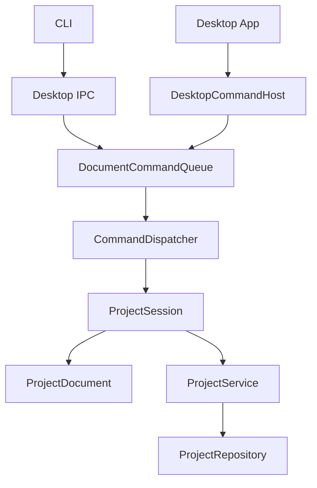

# ChunkMap Studio 当前代码架构

状态：schema v3 / non-destructive layout architecture

这份文档描述当前实现。历史设计与已完成计划统一归档在
[historical/](./historical/README.md)。

## 1. 产品边界

- Dear ImGui Desktop 是唯一运行中的 document host。
- CLI 只负责解析参数、通过本地 IPC 提交 typed command、打印结果。
- Desktop 未启动时，项目命令返回 `desktop_not_running`，CLI 不直接写文件。
- 应用负责项目、Prompt、Context handoff、Chunk 导入与 Seam 检查；不负责 AI 生图。
- Chunk 只有 `Empty` 与 `Ready`，没有 Seed、Candidate、Approval、History 或 Provenance。
- 没有项目 Composite，也不自动导出整图；用户可显式导出项目外 PNG。

## 2. 运行时调用链



`DocumentCommandQueue` 在单独 worker 上 FIFO 执行所有正式命令，因此 Desktop 与 CLI
不会并发修改同一个项目。`ChangeSet` 把局部变化通知 Desktop；不依赖 watcher 或 event
文件。

## 3. 长生命周期文档

`ProjectSession` 持有当前 workspace 的 `ProjectService` 和当前打开的
`ProjectDocument`。同一个 workspace/project 的普通命令复用同一文档，不再每条命令
调用 `open_project()`。

`project current` 不读取进程启动参数，也不把普通 `--project` 命令临时加载的 document
误认为 Desktop 当前项目。`CommandDispatcher` 单独记录最近一次成功的
`ProjectCreate` / `ProjectOpen`，并以只读方式返回其 project 名称和 workspace；查询本身
不加载或切换 project。Desktop 尚未打开 project 时返回 `no_project_open`。

`ProjectDocument` 常驻内容：

- `ProjectConfig` 与 `ProjectPaths`；
- Global Prompt；
- 每个坐标的 Chunk Prompt；
- 每个坐标的 Ready 状态；
- 按需加载的 `ImageBuffer`。

图片采用 lazy load：打开项目只读取文件是否存在，不解码所有 PNG；第一次需要 CPU
像素时才加载。Prompt 与 Ready 状态以 session 内存为运行时权威。用户在外部修改文件
后，只有显式执行 `ProjectOpen`（Desktop Reload）才会原子替换当前文档。

Mutation 顺序是：

```text
验证输入
  -> 原子持久化受影响的正式文件
  -> 更新对应 ChunkDocument / Prompt
  -> 发布局部 ChangeSet
```

持久化失败时不发布内存变化。

Concept Grid 的 columns/rows 可在第一张 Chunk 图片导入前通过 `ProjectGridSet`
修改。该命令要求 `chunk_size` 尚未建立、Chunks 与 Local Prompts 均为空；成功后原子
更新 `project.json` 并重建空的 `ProjectDocument` 坐标数组。Concept 与 Global Prompt
保持不变。第一张 Chunk 图片建立尺寸后，Grid 永久锁定。
Desktop 入口为独立的 `Project > Change Grid...` modal，不嵌入 Project Settings。

## 4. 最小持久化格式

```text
output/<project-name>/
  project.json
  concept.png
  global_prompt.md       # 仅非空时存在
  prompts/
    <x>_<y>.md           # 仅非空时存在
  chunks/
    <x>_<y>.png          # 仅 Ready 时存在
  placements.json        # 仅存在非零 placement 时存在
  seams/
    <canonical-key>.json # 仅用户编辑过的 Seam override
```

`project.json` schema v3 只保存：

```json
{
  "schema_version": 3,
  "columns": 4,
  "rows": 4,
  "chunk_size": [1024, 1024],
  "overlap_ratio": [0.15, 0.15]
}
```

项目名来自目录名；Concept 路径固定；不重复保存 `name`、`concept_file` 或
`feather_ratio`。schema v1/v2 在打开时一次性迁移正式内容，然后删除旧 `concept/`、
`context/`、`cache/`、metadata 与坐标子目录。

## 5. 正式文件与 handoff

项目目录只保存无法从其他正式输入推导的内容。以下都不是项目状态：

- Concept region crops；
- generation template/mask/manifest；
- Seam overlap/difference/metrics；
- Chunk metadata；
- Composite。

非零 Chunk placement 稀疏保存在 `placements.json`；用户编辑过的 Seam 以 canonical
right/bottom key 分文件保存在 `seams/`。两者都是排版参数，不是派生图片。

Concept 与 Chunk Context 导出到：

```text
<workspace>/.chunkmap/handoff/<project>/
```

它们可以随时覆盖或删除。Context 中的 Concept regions 只用于理解布局、写 Prompt；
详细 Chunk 生成只使用 Ready 邻居形成的 template 与 mask。

`docs/PROMPT_AUTHORING_GUIDE.md` 是 Global/Local Prompt 语义、generation-time
wrapper 纪律与视觉验收标准的单一规范源。CMake 在构建时将它嵌入 Core；
`concept context` 与首张 Chunk import 会把同一内容写到 handoff 的
`prompt-authoring-guide.md`，并通过 command JSON/manifest 返回 `authoring_guide`
路径。JSON Schema 只负责传输结构，不重复语义规范。

Chunk Inspector 的 `Export Concept Slice...` 是独立的显式导出：它只裁切选中坐标的
Concept region，写入用户选择的项目外 PNG，不创建整套 regions，也不改变项目状态。

## 6. 图片写入规则

`chunk import`：

- 任意坐标均可导入，不要求邻居；
- 第一张图确定 `chunk_size`；
- 要求精确匹配 Chunk 尺寸；
- 不静默平移或覆盖邻居 overlap；
- 原样保存为一个正式 Ready PNG。

`chunk write`：

- 至少需要一个 Ready 正交邻居；
- 使用严格尺寸验证并原样保存目标 Chunk PNG；
- 根据所有 Ready 正交邻居执行有限、确定性的整体平移 registration；
- 将 offset 稀疏保存为 placement，不把平移烘焙进 PNG；
- 不执行羽化、protected restore 或任何 PNG 后处理。

Seam 是独立排版层：canonical right/bottom pair 保存可编辑折线和 feather width。Core
仅为 overlap 尺寸生成小 patch；Canvas 和 Full Map Export 使用相同 renderer 与固定的
right-then-bottom 顺序。Seam Inspect 按请求读取 placement 后的两张图并在内存返回 metrics、
overlap preview 与 difference preview。

## 7. Desktop 渲染

Map Canvas 根据 overlap geometry 与 placement UV 逐张绘制原始 Ready texture，再叠加
缓存于内存的小型 Seam patch；不存在完整合成贴图。Empty 坐标直接使用 `concept.png` 的 UV 子区域
作为背景，不生成 region crop。

缩放交互与 `tile_map_editor_imgui` Toolbar 对齐：Reset Scale 回到 1:1 与左上角，Fit Map
使用连续比例居中完整地图；滚轮在预设比例档位间跳转，并保持鼠标下的世界坐标不动；
鼠标中键和右键拖动均可平移画布。

`TextureCache` 独立于 `ProjectDocument` 的 CPU image cache：

- 常规显示按路径 lazy upload；
- Chunk mutation 的内存图片随 `CommandResult` 直接上传，不再次解码 PNG；
- 只失效发生变化的 texture；
- Reload/切换项目清空旧 texture cache。

Desktop Import 使用异步 command completion，不阻塞 frame loop。Seam preview 也直接从
内存 `ImageBuffer` 上传临时 texture。

Ready Chunk 的 Alignment 控件使用 `ChunkAlignmentPreview` 在内存生成手动或 Auto 平移
预览，Canvas 与 Inspector 共用临时 texture；`ChunkShiftApply` 只保存 placement JSON。
切换 Chunk、项目、Reload 或 App 失焦会丢弃瞬时预览；保存后的 offset 会随项目重载。

Seam Editor 是 modeless window，只解码两张相邻原图并重算 overlap patch。折线控制点可
拖动、添加、删除，feather width 可实时调整；Save 只写 Seam JSON，Cancel 恢复已保存参数。

Auto 的 Core 边界分为 Low-resolution 2D、Projection、共同精修/选优三部分。两个算法都运行，
共同 score 选择默认结果；Panel 保留两组瞬时诊断并允许切换预览，不把算法选择写入项目。

Chunk Inspector 的 `Hold: This Chunk` 与 `Hold: Full Map` 是纯瞬时 Desktop 对比控件。
按住前者时，Canvas 在选中 chunk 的完整 footprint（包括 overlap）显示对应 Concept
region；按住后者时显示完整 Concept Map。松开按钮、切换 Inspector 页面、切换 chunk
或 App 失焦都会恢复正式图片。该行为不进入 `ProjectDocument` 或会话持久状态，也不影响
Ready、Context、Seam 与导出。

## 8. 代码目录

```text
src/
  command/   typed request/result、codec、dispatcher、FIFO queue
  ipc/       Desktop local server 与 CLI client transport
  model/     ProjectConfig、ProjectDocument、ChunkDocument
  project/   paths、schema repository、session、业务 service
  image/     RGBA buffer、geometry、registration、layout renderer、template、seam analysis
  io/        atomic file writes
  ui/        与 ImGui 无关的 map geometry/hit testing
desktop/     App、command host、OpenGL texture cache
cli/         参数解析与 IPC request/output
tests/       Core、command、CLI integration、Desktop smoke
```

Core 不依赖 ImGui/OpenGL。CLI 不构造 `ProjectService`。Panel/App 不直接修改正式文件。

显式整图导出同样走 command queue。`MapExport` 在 Core 中按 Desktop 的 chunk 绘制顺序，
使用有界 RGBA band 和 streaming PNG writer 写到项目目录外；它不修改 document、
`ChangeSet` 或项目文件。

## 9. 验证

```bash
cmake -S . -B build
cmake --build build -j 8
ctest --test-dir build --output-on-failure
```

测试覆盖最小目录、sparse Prompt、schema v1/v2→v3 migration、PNG 不变性、placement/Seam
持久化、折线 overlap renderer、无派生文件副作用、in-memory session reload 语义、
CLI/IPC contract 与 Desktop smoke。

## 10. 明确不做

- 项目 Composite 或自动整图导出；
- undo/redo；
- generation jobs、candidate/approval/history；
- provenance、revision、neighbor hash；
- 后台文件 watcher；
- 持久化 Context、Seam cache、Concept crops 或 metadata；
- 为显示地图构建整张 CPU RGBA buffer。
