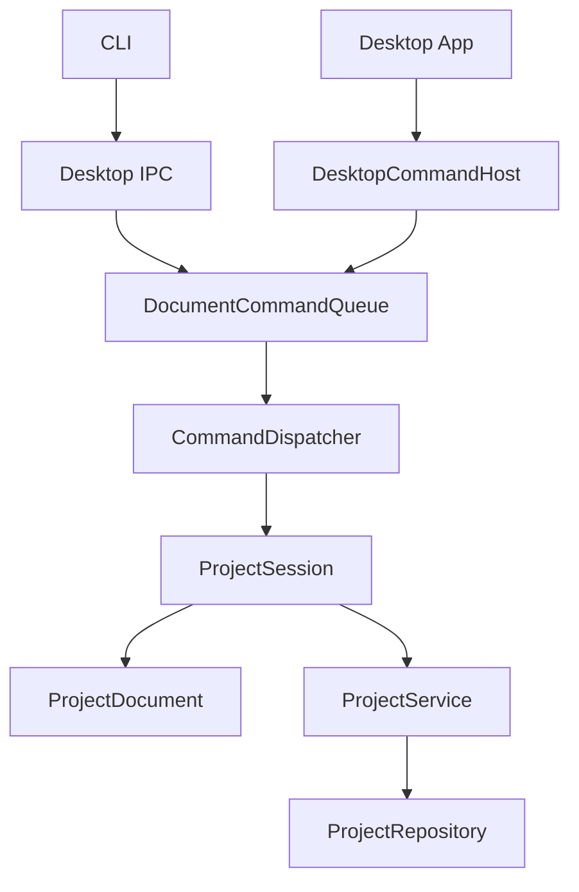

# ChunkMap Studio 当前代码架构

状态：schema v2 / in-memory document architecture

这份文档描述当前实现。历史设计与本次两阶段重构的详细取舍见
[IN_MEMORY_DOCUMENT_RENDERING_PLAN.md](./IN_MEMORY_DOCUMENT_RENDERING_PLAN.md)。

## 1. 产品边界

- Dear ImGui Desktop 是唯一运行中的 document host。
- CLI 只负责解析参数、通过本地 IPC 提交 typed command、打印结果。
- Desktop 未启动时，项目命令返回 `desktop_not_running`，CLI 不直接写文件。
- 应用负责项目、Prompt、Context handoff、Chunk 导入与 Seam 检查；不负责 AI 生图。
- Chunk 只有 `Empty` 与 `Ready`，没有 Seed、Candidate、Approval、History 或 Provenance。
- 没有项目 Composite，也不自动导出整图。

## 2. 运行时调用链



`DocumentCommandQueue` 在单独 worker 上 FIFO 执行所有正式命令，因此 Desktop 与 CLI
不会并发修改同一个项目。`ChangeSet` 把局部变化通知 Desktop；不依赖 watcher 或 event
文件。

## 3. 长生命周期文档

`ProjectSession` 持有当前 workspace 的 `ProjectService` 和当前打开的
`ProjectDocument`。同一个 workspace/project 的普通命令复用同一文档，不再每条命令
调用 `open_project()`。

`ProjectDocument` 常驻内容：

- `ProjectConfig` 与 `ProjectPaths`；
- Global Prompt；
- 每个坐标的 Chunk Prompt；
- 每个坐标的 Ready 状态；
- 按需加载的 `ImageBuffer`。

图片采用 lazy load：打开项目只读取文件是否存在，不解码所有 PNG；第一次需要 CPU
像素时才加载。Prompt 与 Ready 状态以 session 内存为运行时权威。用户在外部修改文件
后，只有显式执行 `ProjectOpen`（Desktop Reload）才会原子替换当前文档。

Mutation 顺序是：

```text
验证输入
  -> 原子持久化受影响的正式文件
  -> 更新对应 ChunkDocument / Prompt
  -> 发布局部 ChangeSet
```

持久化失败时不发布内存变化。

## 4. 最小持久化格式

```text
output/<project-name>/
  project.json
  concept.png
  global_prompt.md       # 仅非空时存在
  prompts/
    <x>_<y>.md           # 仅非空时存在
  chunks/
    <x>_<y>.png          # 仅 Ready 时存在
```

`project.json` schema v2 只保存：

```json
{
  "schema_version": 2,
  "columns": 4,
  "rows": 4,
  "chunk_size": [1024, 1024],
  "overlap_ratio": [0.15, 0.15]
}
```

项目名来自目录名；Concept 路径固定；不重复保存 `name`、`concept_file` 或
`feather_ratio`。schema v1 在打开时一次性迁移正式内容，然后删除旧 `concept/`、
`context/`、`cache/`、metadata 与坐标子目录。

## 5. 正式文件与 handoff

项目目录只保存无法从其他正式输入推导的内容。以下都不是项目状态：

- Concept region crops；
- generation template/mask/manifest；
- Seam overlap/difference/metrics；
- Chunk metadata；
- Composite。

Concept 与 Chunk Context 导出到：

```text
<workspace>/.chunkmap/handoff/<project>/
```

它们可以随时覆盖或删除。Context 中的 Concept regions 只用于理解布局、写 Prompt；
详细 Chunk 生成只使用 Ready 邻居形成的 template 与 mask。

## 6. 图片写入规则

`chunk import`：

- 任意坐标均可导入，不要求邻居；
- 第一张图确定 `chunk_size`；
- 允许确定性的 1px 尺寸补齐；
- 保存为一个正式 Ready PNG。

`chunk write`：

- 至少需要一个 Ready 正交邻居；
- 使用同一套尺寸验证与 1px normalization；
- 从 fresh template 恢复所有 opaque 保护像素；
- 只原子替换目标 Chunk PNG。

不进行自动平移 registration，不写 metadata，不重建 Seam 或 Composite。Seam Inspect
按请求读取两张正式图并在内存返回 metrics、overlap preview 与 difference preview。

## 7. Desktop 渲染

Map Canvas 根据 overlap geometry 逐张绘制 Ready chunk texture。后绘制的更大坐标拥有
overlap 区域，命中测试采用相同顺序。Empty 坐标直接使用 `concept.png` 的 UV 子区域
作为背景，不生成 region crop。

`TextureCache` 独立于 `ProjectDocument` 的 CPU image cache：

- 常规显示按路径 lazy upload；
- Chunk mutation 的内存图片随 `CommandResult` 直接上传，不再次解码 PNG；
- 只失效发生变化的 texture；
- Reload/切换项目清空旧 texture cache。

Desktop Import 使用异步 command completion，不阻塞 frame loop。Seam preview 也直接从
内存 `ImageBuffer` 上传临时 texture。

## 8. 代码目录

```text
src/
  command/   typed request/result、codec、dispatcher、FIFO queue
  ipc/       Desktop local server 与 CLI client transport
  model/     ProjectConfig、ProjectDocument、ChunkDocument
  project/   paths、schema repository、session、业务 service
  image/     RGBA buffer、geometry、normalization、template、seam analysis
  io/        atomic file writes
  ui/        与 ImGui 无关的 map geometry/hit testing
desktop/     App、command host、OpenGL texture cache
cli/         参数解析与 IPC request/output
tests/       Core、command、CLI integration、Desktop smoke
```

Core 不依赖 ImGui/OpenGL。CLI 不构造 `ProjectService`。Panel/App 不直接修改正式文件。

## 9. 验证

```bash
cmake -S . -B build
cmake --build build -j 8
ctest --test-dir build --output-on-failure
```

测试覆盖最小目录白名单、sparse Prompt、schema v1→v2 migration、保护像素、无派生文件
副作用、in-memory session reload 语义、CLI/IPC contract 与 Desktop smoke。

## 10. 明确不做

- 项目 Composite 或自动整图导出；
- undo/redo；
- generation jobs、candidate/approval/history；
- provenance、revision、neighbor hash；
- 后台文件 watcher；
- 持久化 Context、Seam cache、Concept crops 或 metadata；
- 为显示地图构建整张 CPU RGBA buffer。
