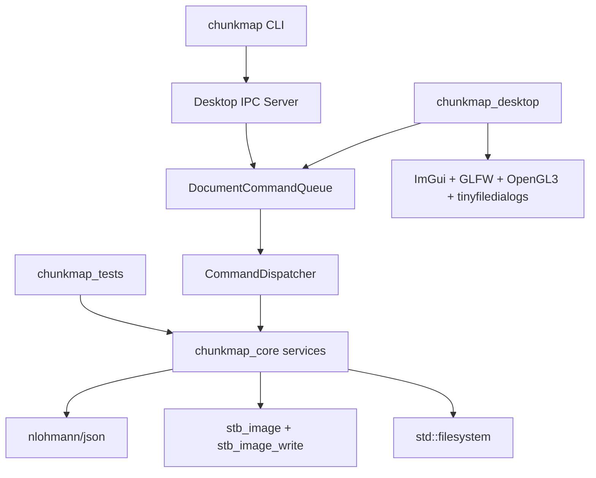

# AI Chunk Map Studio: Code Architecture Design

状态：Phase 6 已实现

实现状态：`0.6.0-phase6` 已实现 Desktop 单实例、typed command、DocumentCommandQueue、
CommandDispatcher、本地 IPC 和 ChangeSet 刷新，并删除 `ProjectWatcher` 与 event 通知链路。

本文在 [DESKTOP_CLI_UX_FLOW.md](./DESKTOP_CLI_UX_FLOW.md) 的产品边界上定义代码架构。参考实现是 `/Users/peter/Desktop/tile_map_editor_imgui`，但只复用适合当前项目的骨架，不复制其复杂编辑器能力。

Phase 6 的 CommandDispatcher、Document Command Queue、Desktop 单实例和 IPC
细节以 [PHASE6_COMMAND_DISPATCHER_DESIGN.md](./PHASE6_COMMAND_DISPATCHER_DESIGN.md)
为准。Phase 6 覆盖本文早期版本中的 `ProjectWatcher` 和 event 文件通知设计。

## 1. 参考项目架构总结

`tile_map_editor_imgui` 是一个典型的 C++17、CMake、Dear ImGui 桌面编辑器，整体分成四层。

### 1.1 构建层

顶层 `CMakeLists.txt` 定义：

- `adna` 静态核心库。
- `tilemap_editor` Desktop executable。
- `adna_tests` 测试 executable。

`desktop/CMakeLists.txt` 使用 `FetchContent` 获取：

- GLFW 3.4。
- Dear ImGui docking branch。
- tinyfiledialogs。

Desktop 链接：

- `adna`
- `imgui`
- `tinyfd`
- `OpenGL::GL`

核心代码不依赖 ImGui 或 OpenGL，因此测试和无头操作可以复用同一套模型与序列化。

### 1.2 Desktop 层

`desktop/src/main.cpp` 负责：

- 创建 GLFW window。
- 初始化 OpenGL 3.3 Core。
- 初始化 ImGui GLFW/OpenGL3 backends。
- 开启 docking、multi-viewport 和 keyboard navigation。
- 执行标准 per-frame loop。

每帧的主要调用链：

```text
glfwPollEvents
  -> ImGui NewFrame
  -> App::draw
  -> ImGui::Render
  -> OpenGL draw data
  -> glfwSwapBuffers
```

`App` 是 Desktop composition root：

- 拥有唯一的 `ViewModel`。
- 构造和持有所有 Panel。
- 创建 DockSpace。
- 处理菜单、快捷键和模态窗口。
- 每帧调用各 Panel 的 `draw()`。

### 1.3 Core、Command 与 ViewModel

`TileMap` 是根数据模型；`TileMapHandler` 持有当前地图、选中状态和 session settings。

所有主要编辑操作通过 `TileMapCommandHandler`：

```text
Panel
  -> ViewModel operation
  -> TileMapCommandHandler
  -> Command execute / undo / redo
  -> callback
  -> ViewModel fan_out
  -> interested panels
```

这种架构适合复杂编辑器：

- 操作多。
- 需要 undo/redo。
- 同一数据变化会影响多个面板。
- 渲染器需要脏区回调。

代价是 ViewModel 和 callback surface 很大，面板注册、生命周期和命令不变量都需要严格管理。

### 1.4 Canvas 与 Renderer

`TileMapPanel` 使用 `ImGui::Image` 显示 OpenGL texture，并独立保存 viewport transform：

```text
screen = canvas_origin + (source - pan) * zoom
source = pan + (screen - canvas_origin) / zoom
```

它支持：

- Fit to window。
- 鼠标位置中心缩放。
- 平移。
- 屏幕坐标、源图坐标和 tile 坐标转换。
- 使用 `ImDrawList` 绘制 grid、selection 和 HUD overlay。

`TileRenderer` 把 CPU RGBA buffer 上传为 OpenGL texture。模型变化回调只合并 dirty region，实际上传延迟到下一帧，并用 `glTexSubImage2D` 更新局部区域。

### 1.5 Headless 与持久化

参考项目的 headless mode 仍创建 ImGui context，通过 stdin 读取逐行 JSON，并在 `App::draw()` 中执行 `HeadlessCommandHandler`。

其优点是 GUI 和无头模式复用同一个 `ViewModel`。缺点是 CLI 与 Desktop 生命周期耦合，普通一次性 CLI 命令也需要进入 App/headless loop。

持久化层使用 nlohmann/json，并通过临时文件加 rename 原子写入，避免中途崩溃损坏正式文件。

### 1.6 对当前项目的启发

应该复用：

- CMake target 分层。
- Core 不依赖 ImGui/OpenGL。
- GLFW + OpenGL3 + ImGui docking 的 Desktop bootstrap。
- tinyfiledialogs 的薄封装。
- `ImGui::Image` 画布和显式 viewport transform。
- stb_image/stb_image_write 的 RGBA8 图片抽象。
- nlohmann/json。
- 原子文件写入。
- core unit tests 加 Desktop smoke test。

不应该复用：

- undo/redo 和持久化 command history。
- 大型 callback fan-out ViewModel。
- Panel 自注册回调模型。
- stdin JSON headless App loop。
- 脏 tile renderer。
- AI GenerationJob、持久化任务队列和生成状态。

Phase 6 引入的 `DocumentCommandQueue` 只串行化正式文档命令，不提供 undo、replay、
AI 任务或用户可见进度。它用于保证 Desktop 和 CLI 不能绕过同一条写入通路。

## 2. 目标架构

### 2.1 总体原则

1. Desktop 和 CLI 共享一个无 UI 依赖的 `chunkmap_core`。
2. 所有正式文件操作只通过 `DocumentCommandQueue -> CommandDispatcher -> ProjectService`。
3. Desktop 不调用 AI，也不创建生成任务。
4. CLI 不依赖 ImGui、GLFW 或 OpenGL。
5. Codex 先用 CLI 导出 context，生图后再用 CLI 写回。
6. 每个 chunk 只有 Empty 或 Ready。
7. 写回默认覆盖，不保留候选图和图片历史。
8. 第一版不实现 undo/redo、revision conflict 和邻居 hash 检查。
9. Desktop 是必须运行的单实例 document host；CLI 只通过本地 IPC 提交 command。
10. Desktop 未运行时 CLI 返回 `desktop_not_running`，不能本地写项目。

### 2.2 依赖方向



禁止反向依赖：

- `chunkmap_core` 不能 include Desktop headers。
- `chunkmap_core` 不能调用 ImGui 或 OpenGL。
- CLI 不能执行 Desktop `App` UI，也不能创建本地 ProjectService；它只通过 IPC 提交 command。
- Panel 不能直接修改项目 JSON 或图片文件。
- CLI handler 不能直接调用 `ProjectService` mutation API。

### 2.3 CMake targets

```text
chunkmap_core      STATIC
chunkmap_desktop   EXECUTABLE
chunkmap           EXECUTABLE
chunkmap_tests     EXECUTABLE
```

职责：

| Target | 职责 |
|---|---|
| `chunkmap_core` | Command model/queue/dispatcher、项目模型、文件 IO、图片处理、context、拼接 |
| `chunkmap_desktop` | ImGui App、Desktop command host、IPC server、画布、Inspector、纹理和文件对话框 |
| `chunkmap` | CLI 参数解析、typed request、IPC client、JSON/text 输出 |
| `chunkmap_tests` | Core unit tests 和 CLI integration tests |

## 3. 建议仓库结构

```text
chunkmap-studio/
  CMakeLists.txt
  cmake/
  src/
    command/
      command_request.h
      command_result.h
      command_codec.h
      command_codec.cpp
      command_dispatcher.h
      command_dispatcher.cpp
      document_command_queue.h
      document_command_queue.cpp
    ipc/
      desktop_ipc_client.h
      desktop_ipc_client.cpp
      desktop_ipc_server.h
      desktop_ipc_server.cpp
      unix_socket_transport.cpp
      windows_named_pipe_transport.cpp
    model/
      chunk_coord.h
      project.h
      project_config.h
    project/
      project_repository.h
      project_repository.cpp
      project_service.h
      project_service.cpp
      project_paths.h
      project_paths.cpp
    image/
      image_buffer.h
      image_buffer.cpp
      template_builder.h
      template_builder.cpp
      composite_builder.h
      composite_builder.cpp
      seam_analyzer.h
      seam_analyzer.cpp
      image_normalizer.h
      image_normalizer.cpp
    context/
      concept_context_exporter.h
      concept_context_exporter.cpp
      chunk_context_exporter.h
      chunk_context_exporter.cpp
    io/
      atomic_file.h
      atomic_file.cpp
      json_codec.h
      json_codec.cpp
  desktop/
    CMakeLists.txt
    src/
      main.cpp
      app.h
      app.cpp
      editor_session.h
      editor_session.cpp
      file_dialog.h
      file_dialog.cpp
      desktop_command_host.h
      desktop_command_host.cpp
      command_completion.h
      command_completion.cpp
      gl_texture.h
      gl_texture.cpp
      panels/
        map_canvas.h
        map_canvas.cpp
        chunk_inspector.h
        chunk_inspector.cpp
        prompt_editor.h
        prompt_editor.cpp
        seam_inspector.h
        seam_inspector.cpp
        toolbar.h
        toolbar.cpp
  cli/
    CMakeLists.txt
    src/
      main.cpp
      cli_app.h
      cli_app.cpp
      command_parser.h
      command_parser.cpp
      output_writer.h
      output_writer.cpp
  tests/
    CMakeLists.txt
    test_project_repository.cpp
    test_chunk_import.cpp
    test_template_builder.cpp
    test_composite_builder.cpp
    test_prompt_overwrite.cpp
    test_chunk_overwrite.cpp
    test_context_export.cpp
    test_cli_smoke.cpp
  docs/
  third_party/
  build/
  output/
    <project-name>/
```

第一版不创建 `include/` 镜像树。和参考项目一样，target 直接公开 `src/` include root，header 与实现按模块放在一起。

## 4. Core 数据模型

### 4.1 ChunkCoord

```cpp
struct ChunkCoord {
    int x = 0;
    int y = 0;

    bool operator==(const ChunkCoord& other) const {
        return x == other.x && y == other.y;
    }
};
```

另行提供 `ChunkCoordHash`，保持与参考项目一致的 C++17 标准。

坐标合法条件：

```text
0 <= x < columns
0 <= y < rows
```

### 4.2 ProjectConfig

```cpp
struct ProjectConfig {
    int schema_version = 1;
    std::string name;
    int columns = 0;
    int rows = 0;

    std::optional<int> chunk_width;
    std::optional<int> chunk_height;
    double horizontal_overlap_ratio = 0.15;
    double vertical_overlap_ratio = 0.15;
    double feather_ratio = 0.03;
};
```

规则：

- 创建项目时 chunk size 为空。
- 导入第一张 chunk 图片后，由其原图写入 chunk size。
- 后续正式图必须匹配 chunk size，允许已定义的 1px 规范化。
- ProjectConfig 不保存生成进度、候选版本或历史版本。

### 4.3 ChunkDocument

```cpp
struct ChunkDocument {
    ChunkCoord coord;
    std::filesystem::path directory;
    std::filesystem::path prompt_path;
    std::filesystem::path image_path;
    bool ready() const;
};
```

`ready()` 由正式 `image.png` 是否存在且可解码决定，不维护额外状态机。

### 4.4 NeighborSet

```cpp
struct NeighborSet {
    std::optional<ChunkDocument> top;
    std::optional<ChunkDocument> bottom;
    std::optional<ChunkDocument> left;
    std::optional<ChunkDocument> right;

    int ready_count() const;
};
```

`ProjectService` 每次按当前文件状态解析邻居，不缓存长期对象指针。

### 4.5 EditorSession

`EditorSession` 是 Desktop-only UI state，不写入 `project.json`：

```cpp
struct EditorSession {
    std::optional<ChunkCoord> selected_chunk;
    float pan_x = 0.0f;
    float pan_y = 0.0f;
    float zoom = 1.0f;
    bool fit_to_window = true;
    bool show_grid = true;
    bool show_coordinates = true;
    bool show_seams = false;
    std::string prompt_buffer;
};
```

UI selection、viewport 和未到 debounce 时间的文本 buffer 不属于正式项目数据。

## 5. ProjectService

### 5.1 定位

`ProjectService` 是无 UI 的项目 application service。Phase 6 后，Desktop 和 CLI 不直接调用
它的 mutation API；唯一调用入口是 `CommandDispatcher`。它不是大型 ViewModel，也不保存
ImGui、IPC 或 queue 状态。

```cpp
class ProjectService {
    friend class CommandDispatcher;

private:
    Result<Project> create_project(const CreateProjectRequest& request);
    Result<Project> open_project(const std::string& project_name);
    Result<ChunkWriteResult> import_chunk_image(Project&, ChunkCoord, const path& image);
    Result<void> write_prompt(Project&, ChunkCoord, std::string_view text);
    Result<void> import_prompts(Project&, const path& prompts_json);
    Result<ConceptContext> export_concept_context(Project&);
    Result<ChunkContext> export_chunk_context(Project&, ChunkCoord);
    Result<ChunkWriteResult> write_chunk_image(Project&, ChunkCoord, const path& image);
    Result<void> remove_chunk_image(Project&, ChunkCoord);
    Result<void> rebuild_composite(Project&);
};
```

`ProjectService` 保持同步，负责单次操作的业务语义。命令串行、IPC 接收和 UI invalidation
分别由 `DocumentCommandQueue`、`DesktopIpcServer` 和 `ChangeSet` 负责。

### 5.2 默认覆盖语义

以下操作默认覆盖：

- `write_prompt` 覆盖该坐标当前 `prompt.md`。
- `import_prompts` 覆盖输入 JSON 中出现的坐标。
- `write_chunk_image` 覆盖该坐标当前正式 `image.png`。
- `export_chunk_context` 覆盖该坐标旧 context。

不提供 `--replace`、`--replace-edited`、revision conflict 或 neighbor hash check。

### 5.3 Result

第一版使用轻量结果类型：

```cpp
struct Error {
    std::string code;
    std::string message;
};

template<class T>
class Result;
```

CLI 把 Error 转成 stderr 和非零 exit code。Desktop 把 Error 显示为 modal 或状态栏消息。

不要抛异常穿过 Desktop/CLI 边界。JSON parse、filesystem 和 image decode 异常在 Repository/Service 内转换成 Result。

## 6. ProjectRepository 与路径

### 6.1 WorkspacePaths

```cpp
class WorkspacePaths {
public:
    path root;
    path output_root() const;                  // root/output
    path project_root(string_view name) const; // root/output/<name>
};
```

CLI：

- `--project my-world` 解析为 `<workspace>/output/my-world`。
- 默认 workspace 是当前工作目录。
- 可选全局 `--workspace <path>`，方便 Codex 从其他目录调用。

Desktop：

- 首次启动使用当前工作目录。
- 打开项目后保存最近 workspace 和 project name 到 Desktop config。
- 正式项目数据始终位于 `output/<project-name>/`。

### 6.2 ProjectPaths

`ProjectPaths` 集中生成所有路径，其他模块禁止手拼字符串：

```cpp
class ProjectPaths {
public:
    path project_json() const;
    path concept_source() const;
    path concept_region(ChunkCoord) const;
    path chunk_dir(ChunkCoord) const;
    path chunk_prompt(ChunkCoord) const;
    path chunk_image(ChunkCoord) const;
    path chunk_metadata(ChunkCoord) const;
    path concept_context_dir() const;
    path chunk_context_dir(ChunkCoord) const;
    path composite_png() const;
    path composite_preview() const;
};
```

Phase 6 不再创建 `events/events.jsonl`。旧项目中的 `events/` 被忽略；Desktop 更新来自
command completion 的 `ChangeSet`。

### 6.3 原子写入

正式写入统一使用：

```text
target.tmp
  -> flush and close
  -> rename target.tmp to target
```

适用：

- `project.json`
- `prompt.md`
- `image.png`
- `metadata.json`
- `composite.png`

图片覆盖不保留旧版本。临时文件只用于保证单次写入完整。

### 6.4 project.json

示例：

```json
{
  "schema_version": 1,
  "name": "my-world",
  "columns": 3,
  "rows": 3,
  "chunk_size": [1433, 1098],
  "overlap_ratio": [0.15, 0.15],
  "feather_ratio": 0.03
}
```

首张图片尚未导入时：

```json
"chunk_size": null
```

不在 project.json 保存每个 chunk 的 Empty/Ready；正式图片存在即可判定。

## 7. Image 模块

### 7.1 ImageBuffer

参考 `adna::Image`，实现单一 RGBA8 内存格式：

```cpp
class ImageBuffer {
public:
    int width = 0;
    int height = 0;
    std::vector<uint8_t> rgba;

    static Result<ImageBuffer> load(const path&);
    Result<void> save_png(const path&) const;
    ImageBuffer crop(Rect rect) const;
    void blit(const ImageBuffer&, Rect src, Point dst);
};
```

底层使用 stb_image 和 stb_image_write。Core 中不保留 Pillow runtime 依赖。

### 7.2 TemplateBuilder

输入：

- Target coord。
- Project chunk size。
- 1 到 4 个 Ready orthogonal neighbors。
- Horizontal/vertical overlap pixels。

规则：

```text
left neighbor.right strip   -> target.left edge
right neighbor.left strip   -> target.right edge
top neighbor.bottom strip   -> target.top edge
bottom neighbor.top strip   -> target.bottom edge
```

目标 image 初始为透明 RGBA。固定粘贴顺序：

```text
top -> bottom -> left -> right
```

后粘贴的边覆盖角落。不做冲突检查。

必须测试：

- 1 边模板。
- 相邻 2 边模板。
- 相对 2 边模板。
- 3 边模板。
- 4 边模板。
- 每种模板的 alpha bounds 和像素来源。

### 7.3 ImageNormalizer

CLI 写回时：

- 尺寸完全一致，直接接受。
- 宽或高只差 1px，尝试四个边缘补像素方案。
- 根据现有 overlap 区平均差选择误差最低方案。
- 方向或比例错误，返回错误。
- 更大尺寸差异，返回错误。
- 不缩放。

如果目标没有相应方向邻居，1px 补边优先放在 world boundary 一侧；仍无法判断时固定放到右或下，保证确定性。

### 7.4 ImageRegistration

`ImageNormalizer` 之后、正式写入之前执行受限的平移配准：

- chunk 的世界坐标和固定尺寸不变，不引入运行时 offset。
- 在最多 `-12px..+12px` 范围内，为所有 Ready 邻居联合搜索同一个 `(dx,dy)`。
- 评分以道路、楼梯、悬崖和海岸等结构梯度为主，RGB 差异为辅，并惩罚大位移。
- 先以 2px 步长粗搜，再在最佳点周围以 1px 精搜。
- 最优点落在搜索边界、改善不足或没有 Ready 邻居时保持 `(0,0)`。
- 接受后把平移烘焙进固定尺寸图片，暴露边缘采用像素延展补齐。
- 多邻居不能分别移动；一个联合 offset 必须同时改善现有接缝。
- metadata 保存是否应用、offset 和前后评分，CLI JSON 同步返回。

用户导入和 AI 写入共用规范化、配准、metadata、Composite 与 Seam 重建管线。`chunk import` 不要求邻居；`chunk write` 至少需要一个 Ready 正交邻居。导入图若已有邻居，也使用同一套配准算法。

### 7.5 CompositeBuilder

Composite 只使用 Ready chunk。

世界像素尺寸：

```text
width  = chunk_width  + (columns - 1) * horizontal_step
height = chunk_height + (rows - 1) * vertical_step
```

Empty chunk 对应区域保持透明。

羽化规则：

- 保留完整 overlap。
- 不硬贴旧参考条。
- 不删除 overlap 后硬切。
- feather width 始终基于单个 chunk 尺寸计算。
- 不能基于已经变大的中间合并图计算 feather width。

```text
horizontal_feather_px = round(chunk_width * feather_ratio)
vertical_feather_px   = round(chunk_height * feather_ratio)
```

第一版采用固定的两阶段算法：

1. 每一行先创建透明的 full-world-width row canvas，按 x 从左到右放入 Ready chunk；只有相邻两个坐标都 Ready 时才在水平 overlap 中使用固定 feather。
2. 再创建透明的最终 canvas，按 y 从上到下合并 row canvas；只有上下对应像素都有内容时才在垂直 overlap 中使用固定 feather。

Empty chunk 保持透明，不跨越空洞混合。合并顺序固定，因此输出确定。必须用 3x3 golden test 锁定四块交点，并确认第二、第三条接缝的 feather 不会随中间 canvas 变宽。

### 7.6 SeamAnalyzer

只计算显示所需指标：

- 方向。
- overlap size。
- Mean absolute RGB difference。
- feather size。
- overlap preview。
- difference preview。

指标不改变图片状态，不阻止写回。

## 8. Context 导出

### 8.1 ConceptContextExporter

输出到：

```text
output/<project>/context/concept/
```

内容：

- `manifest.json`
- Concept Map 路径。
- Columns/Rows。
- 所有 region paths。
- `prompts.schema.json`
- 建议 write command。

Codex 分析完成后调用 `prompts import`。输入中出现的坐标直接覆盖当前 prompt。

### 8.2 ChunkContextExporter

输出到：

```text
output/<project>/context/chunk_<x>_<y>/
```

内容：

- `manifest.json`
- `template.png`
- `mask.png`，白色为可生成区域，黑色为受保护的邻居像素。
- `prompt.txt`
- Target coord。
- Expected size。
- Overlap/feather parameters。
- Ready neighbor directions and image paths。
- 建议 write command。

不包含：

- Concept Map image。
- Concept region crop。
- Job id。
- Claim state。
- Candidate path。
- Neighbor hash。
- Version id。

CLI 每次导出同一坐标时覆盖旧 context。

## 9. CLI 架构

### 9.1 独立 executable

CLI 是普通一次性 IPC client。所有业务 execution 都发生在已经运行的 Desktop：

```text
main
  -> CommandParser
  -> typed CommandRequest
  -> DesktopIpcClient
  -> Desktop DocumentCommandQueue
  -> Desktop CommandDispatcher
  -> stdout/stderr
  -> exit
```

不创建：

- GLFW window。
- OpenGL context。
- ImGui context。
- Desktop App。
- background listener。

CLI 不创建 Desktop UI，也不在本进程构造 ProjectService。Desktop 未运行时返回
`desktop_not_running`，不修改项目。

### 9.2 CommandParser

第一版命令有限，可以使用小型手写 parser，不引入重型 CLI framework。

全局参数：

```text
--workspace <path>
--project <name>
--json
```

子命令：

```text
project init/status/validate
chunk import/context/write/show/remove
concept context
prompts import
prompt show/set
render
seam inspect
map export
```

### 9.3 CLI 输出

所有 IPC operation 返回同一个内部 `Result<CommandResult>`。OutputWriter 只格式化 Desktop
返回的 command result：

```json
{
  "schema_version": 1,
  "ok": true,
  "command": "chunk context",
  "project": "my-world",
  "data": {}
}
```

错误：

```json
{
  "schema_version": 1,
  "ok": false,
  "command": "chunk context",
  "project": "my-world",
  "error": {
    "code": "chunk_has_no_ready_neighbor",
    "message": "Chunk (0,0) has no Ready orthogonal neighbor."
  }
}
```

JSON 输出必须保持 stdout 纯净；诊断日志写 stderr。

### 9.4 写回语义

`chunk write`：

1. 校验 project、coord、格式和尺寸。
2. 必要时执行允许的 1px normalization。
3. 根据所有 Ready 邻居执行受限 ImageRegistration；无可靠改善时保持不动。
4. 原子覆盖正式 `image.png`。
5. 更新 normalization 与 registration metadata。
6. 重建 Composite 和相关 seam cache。
7. 返回包含 chunk、composite 和 seam invalidation 的 `ChangeSet`。

不检查 context 是否过期，不检查 neighbor hash，不要求 `--replace`。

`prompts import`：

1. 校验 JSON shape 和坐标。
2. 覆盖输入中出现坐标的 `prompt.md`。
3. 未出现坐标保持不变。
4. 返回包含对应 prompt 坐标的 `ChangeSet`。

不区分 AI prompt 与 user-edited prompt，不要求 `--replace-edited`。

以上写回始终在 Desktop queue 内执行。CLI 没有绕过 queue 的 local mode。

## 10. Desktop 架构

### 10.1 Desktop composition root

```cpp
class App {
    DesktopCommandHost command_host_;
    std::optional<Project> project_;
    EditorSession session_;
    MapCanvasPanel map_canvas_;
    ChunkInspectorPanel inspector_;
    ToolbarPanel toolbar_;
};
```

`App::draw()`：

```text
drain command completions
  -> apply ChangeSet to project snapshot, prompt buffer and textures
draw DockSpace
draw Toolbar
draw MapCanvas
draw floating Inspector
flush debounced prompt edit if due
```

没有 undo/redo CommandHandler，也没有 panel callback registry。ImGui 每帧直接读取当前
Project snapshot 和 EditorSession；所有 mutation 通过 `DesktopCommandHost::submit()` 进入
DocumentCommandQueue。

### 10.2 MapCanvasPanel

复用参考项目的 viewport 数学：

```text
screen = canvas_origin + (world - pan) * zoom
world  = pan + (screen - canvas_origin) / zoom
```

输入：

- 左键点击选择 chunk。
- 右键拖拽平移。
- 鼠标滚轮围绕光标缩放。
- 双击聚焦 chunk。
- `F` 聚焦当前 chunk。
- `Home` fit full map。

世界坐标到 chunk 坐标不能简单除以 chunk width，因为 chunk 有 overlap：

```text
chunk_x = floor(world_x / horizontal_step)
chunk_y = floor(world_y / vertical_step)
```

在 overlap 区可能命中两个 chunk。选择规则固定为 world position 对应的较大 x/y chunk，或使用绘制顺序中最上层的 chunk；第一版必须选定一种并测试。

推荐选择绘制顺序最上层的 chunk，使点击结果与视觉一致。

### 10.3 Composite texture

Core 输出 `cache/composite.png`。Desktop 解码后上传为 RGBA OpenGL texture：

- `GL_NEAREST` min/mag filter。
- `GL_CLAMP_TO_EDGE`。
- 文件变更后重建 texture。
- 纹理析构必须发生在 OpenGL context 销毁前。

第一版使用单张 Composite texture，并在打开项目时查询 `GL_MAX_TEXTURE_SIZE`。如果 Composite 超限：

- App 显示明确错误。
- 仍允许查看单个 chunk 和 Prompt。
- GPU texture paging 延后到第二版。

项目创建和首张图片导入后应显示预计 Composite 尺寸，尽早提示限制。

### 10.4 Empty chunk overlay

Composite 中 Empty 区域为透明。MapCanvas 使用 `ImDrawList` 在这些区域绘制：

- 低对比度 concept region texture，或棋盘格。
- 坐标。
- Empty 边框。

Concept region 只用于 App 占位和 Codex 写 prompt，不进入 chunk image context。

### 10.5 ChunkInspectorPanel

只含三个 tabs：

- Chunk。
- Prompt。
- Seam。

Chunk tab 读取当前 Project snapshot；需要查询或修改时提交 typed command：

- Coord。
- Empty/Ready。
- Image size/path。
- Ready neighbor directions/count。
- Thumbnail。

不显示 Generate、Accept、Version 或 progress。

### 10.6 PromptEditorPanel

第一版使用 `ImGui::InputTextMultiline` 或仓库中已有的轻量 ImGui text editor widget。

行为：

- 始终可编辑。
- 标准 selection/copy/paste/undo/redo。
- 不显示 Edit、Save、Revert、Copy Prompt buttons。
- 输入停止后 debounce 自动写入。
- 切换 chunk、失焦或关闭项目时立即写入。

建议 debounce：500ms。该数值是 IO 优化，不是用户可见状态。

Prompt buffer 由 `EditorSession` 持有。选择 chunk 变化时：

1. flush 当前 buffer。
2. 加载新坐标 `prompt.md`。
3. 重置 text editor undo buffer。

### 10.7 SeamInspectorPanel

调用 Core `SeamAnalyzer`，不自行实现图片数学。

显示：

- Direction selector。
- Composite view。
- Raw boundary。
- Difference。
- Overlap only。
- Numeric metrics。

Seam 指标只用于查看，不改变状态。

### 10.8 DesktopCommandHost 与精确刷新

Phase 6 删除 `ProjectWatcher`。DesktopCommandHost 持有 IPC Server、DocumentCommandQueue 和
main-thread completion queue。

每个 command 完成后，App 根据 `ChangeSet` 精确处理：

- `project_changed`：重新载入 Project snapshot。
- `changed_prompts`：目标包含 selected chunk 时更新 editor buffer。
- `changed_chunks`：只 invalidate 对应 chunk texture。
- `composite_changed`：invalidate Composite texture。
- `changed_seams`：只 invalidate 对应 seam texture。

Prompt debounce、切换 chunk 和关闭项目都提交 `PromptSet` command。CLI 写回同一 prompt 时
进入同一 queue，命令顺序自然形成 last writer wins，不增加编辑冲突对话框。

保留手动 Reload 处理 Git、同步工具或调试期间的直接文件修改；正式流程不自动轮询文件。

## 11. App 与 CLI 的共享流程

### 11.1 Codex 写全部 Prompt

```text
Codex
  -> chunkmap concept context
  -> DesktopIpcClient sends typed command
  -> DocumentCommandQueue -> CommandDispatcher
  -> ConceptContextExporter
  -> read source + regions
  -> AI writes prompts.json
  -> chunkmap prompts import
  -> same command route
  -> ProjectService::import_prompts
  -> atomic prompt writes
  -> ChangeSet.changed_prompts
  -> Desktop completion immediately updates prompt editor when it owns the project
```

### 11.2 Codex 生成 Chunk

```text
Codex
  -> chunkmap chunk context x,y
  -> DesktopIpcClient sends typed command
  -> DocumentCommandQueue -> CommandDispatcher
  -> ProjectService resolves 1..4 Ready neighbors
  -> TemplateBuilder writes template.png
  -> ChunkContextExporter writes mask + prompt + manifest
  -> AI generates image from template
  -> chunkmap chunk write x,y --image ...
  -> ImageNormalizer
  -> ImageRegistration against all Ready neighbors
  -> atomic official image overwrite
  -> CompositeBuilder + SeamAnalyzer
  -> ChangeSet with chunk/composite/seams
  -> Desktop completion immediately refreshes the map when it owns the project
```

不使用 Codex 或 CLI 时，Desktop 的 `Export Context` 提交 `ChunkContext` typed command。
外部 Stable Diffusion/ComfyUI 只负责消费 context 并产生图片；用户通过统一的 Import Image
或 Replace Image 回传，项目写入仍由 CommandDispatcher 独占。Desktop 不保存或询问图片来源。

## 12. 不需要的抽象

第一版明确不创建：

- `IImageGenerationProvider`。
- `GenerationJob`。
- `JobQueue`。
- `CandidateRepository`。
- `VersionHistory`。
- `UndoStack`。
- Event bus abstraction。
- Plugin system。
- Database。
- 通用 background worker pool。

Phase 6 只增加 typed `CommandRequest`、单 worker `DocumentCommandQueue` 和本地 IPC；不创建
可继承 Command hierarchy、持久化 command history 或 AI task system。

## 13. 测试架构

### 13.1 Core unit tests

必须覆盖：

- 创建项目后 chunk size 为 null。
- 第一张导入图片确定 chunk size。
- 额外导入图片允许确定性 1px 补边，更大尺寸差异时拒绝。
- 用户图片可以导入无邻居坐标；AI 写入无 Ready 正交邻居时拒绝。
- Prompt import 默认覆盖指定坐标。
- Prompt import 不修改未出现坐标。
- Chunk write 默认覆盖正式图。
- Chunk write 不创建历史文件。
- 1、2、3、4 边 template 像素来源。
- Template 固定 corner overwrite 顺序。
- 1px normalization。
- 受限平移 registration、无收益拒绝和多邻居联合评分。
- Composite 最终尺寸。
- Empty chunk 保持透明。
- Feather width 始终基于单 chunk。
- Seam MAE。
- Context 不包含 Concept Map image reference。
- Chunk context 至少需要一个 Ready neighbor。

### 13.2 CLI integration tests

测试先启动隐藏窗口的真实 `chunkmap_desktop --test-command-server`，等待 IPC endpoint ready，
再在临时 workspace 中执行真实 `chunkmap`：

- `project init` 创建 `output/<name>`。
- `chunk import` 写尺寸，并允许导入不相邻的额外正式图。
- `chunk write` 在无 Ready 正交邻居时失败。
- `concept context --json` 输出可解析路径。
- `prompts import` 覆盖 prompt。
- `chunk context --json` 输出 1 到 4 边 template。
- `chunk write` 写正式图并重建 composite。
- 错误时 stdout JSON 和 exit code 一致。
- 每条命令都由 Desktop queue 执行，不允许测试直接 fallback 到 ProjectService。

另有独立测试不启动 Desktop，确认 CLI 返回 `desktop_not_running` 且 workspace 没有变化。

### 13.3 Desktop smoke tests

业务逻辑不在 Panel，因此 Desktop 测试只需要：

- App 能初始化和关闭。
- Project 能打开。
- Composite texture 能上传。
- Canvas 坐标转换正确。
- 右键 pan 和滚轮 zoom 不改变选择。
- 左键选择正确 chunk。
- Prompt debounce 会提交 `PromptSet` command。
- IPC command completion 能精确刷新 Prompt 和 texture。
- Desktop 未运行时 CLI 返回 `desktop_not_running` 且不写文件。
- Desktop 运行时 CLI command 与 UI command 共享同一 FIFO。

### 13.4 Sanitizers

参考项目：

- 非 MSVC test target 默认开启 ASan + UBSan。
- `ctest --test-dir build --output-on-failure`。

图片尺寸乘法和 RGBA buffer allocation 必须使用 checked `size_t`，防止超大项目整数溢出。

## 14. 实施顺序

### Phase 1: Build skeleton

- 顶层 CMake。
- `chunkmap_core`、CLI、Desktop、tests targets。
- FetchContent dependencies。
- GLFW/OpenGL/ImGui window smoke test。

### Phase 2: Project and CLI foundation

- ProjectConfig、ProjectPaths、Repository。
- Atomic file IO。
- `project init/status/validate`。
- Chunk image import。
- Prompt read/write/import。

### Phase 3: Image pipeline

- ImageBuffer。
- Concept region slicing。
- 1 到 4 边 TemplateBuilder。
- ImageNormalizer。
- CompositeBuilder。
- SeamAnalyzer。
- Context exporters。
- Chunk write。

### Phase 4: Desktop viewer

- App bootstrap。
- MapCanvas pan/zoom/select。
- Composite texture。
- Floating Inspector。
- Prompt text editor auto-write。
- Seam views。
- ChangeSet 驱动的 command completion 刷新。

### Phase 5: Hardening

- CLI JSON contracts。
- Golden image tests。
- ASan/UBSan。
- macOS/Windows path and file-dialog checks。
- Large texture limit messaging。

### Phase 6: Command-owned document mutations

- Typed `CommandRequest`、`CommandResult` 和精确 `ChangeSet`。
- `DocumentCommandQueue -> CommandDispatcher -> ProjectService` 唯一正式写入通路。
- Desktop 单实例与 local IPC server。
- CLI 作为纯 IPC client；Desktop 未运行时明确失败。
- 删除 `ProjectWatcher` 和 `events.jsonl` 通知链路。
- UI/IPC command parity、single-instance 和 shutdown drain 测试。

详细实施顺序见
[PHASE6_COMMAND_DISPATCHER_DESIGN.md](./PHASE6_COMMAND_DISPATCHER_DESIGN.md)。

## 15. 第一版完成标准

- Core 可在不链接 ImGui/OpenGL 的情况下通过测试。
- Desktop 和 CLI 使用同一个 CommandDispatcher 与 ProjectService。
- CLI 不启动 Desktop App 或 ImGui context。
- `output/<project-name>` 是完整项目边界。
- 第一张导入图片决定 chunk size。
- Codex 可以导出 concept context 并覆盖写回全部 prompts。
- Codex 可以导出 1 到 4 边 chunk context。
- Codex 可以默认覆盖写回正式 chunk image。
- Desktop 运行时，CLI 命令通过 IPC 进入同一 queue，并用 ChangeSet 立即刷新。
- Desktop 未运行时 CLI 明确失败，不修改项目文件。
- 所有正式写入必须经过 DocumentCommandQueue，Panel 和 CLI handler 不能绕过。
- Desktop 单实例保证只有一个 document command host。
- App 只有 Empty/Ready，不存在生成任务或图片版本状态。
- Main canvas 支持左键选择、右键平移、滚轮缩放。
- Prompt 是直接可编辑、自动写入的多行 text editor。
- Composite 和 Seam 输出与当前 Python 原型行为一致，并修复中间合并图导致 feather 变宽的问题。
