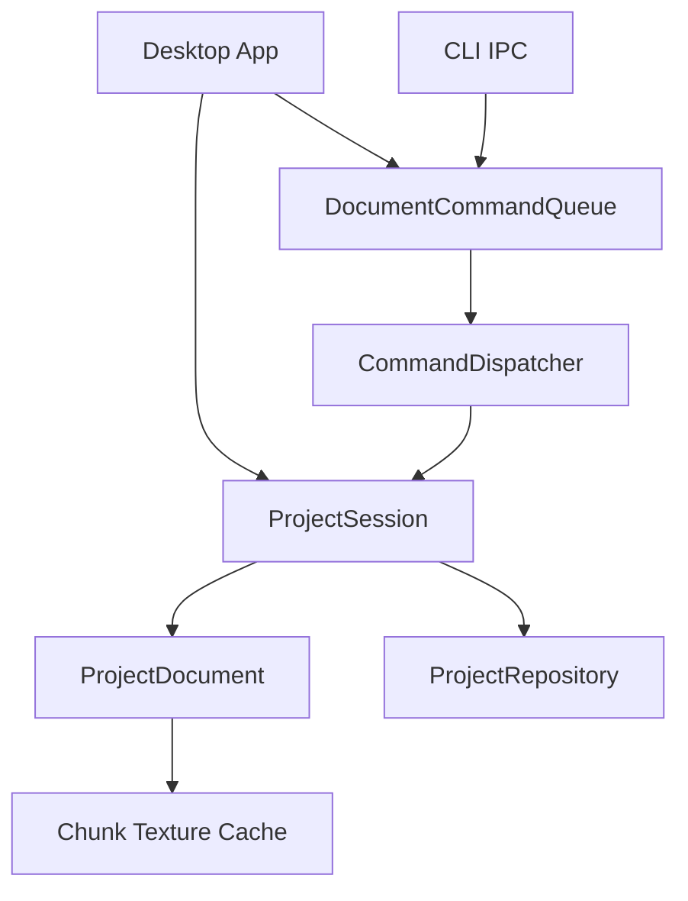

# Desktop 内存文档与逐 Chunk 渲染改造计划

状态：两个阶段已实现（schema v2 + ProjectSession/ProjectDocument）

## 1. 背景与问题

当前 Desktop 被定义为唯一 document host，但实现上只承担了两件事：

- 持有 `DocumentCommandQueue`；
- 作为 CLI IPC 的单实例服务端。

它没有持有完整的内存文档。每条命令都会重新创建 `ProjectService`、从磁盘打开项目，并把项目文件当成运行时状态来源。`App` 只保存 `ProjectConfig + ProjectPaths`、当前选择和纹理缓存。

当前图片写入还会同步执行：

```text
写入单个 chunk
  -> 重新读取所有 Ready chunk
  -> 重建整张 Composite
  -> 编码 cache/composite.png
  -> 重建最多四条 Seam preview
  -> Desktop 重新解码 Composite 并上传整张 GPU texture
```

这导致两个根本问题：

1. “上传一张图片”不再是一个局部操作，而变成了全项目重计算。
2. Desktop UI 使用 `submit_and_wait()` 同步等待完整流程，期间停止绘制，看起来像卡死。

本改造把正式项目数据、Desktop 显示和未来整图导出重新分开。

## 2. 最终产品边界

### 2.1 正式项目内容

正式项目只包含无法从其他内容重新推导的用户数据和结构契约：

```text
output/<project-name>/
├── project.json
├── concept.png
├── global_prompt.md          # 仅在非空时存在
├── chunks/
│   └── <x_y>.png             # 仅 Ready chunk 存在
└── prompts/
    └── <x_y>.md              # 仅非空 Prompt 存在
```

目录本身也是 sparse：Empty chunk 不创建图片文件，空 Prompt 不创建文本文件，空目录不承担状态含义。读取缺失 Prompt 时返回空字符串；用户把 Prompt 清空时删除对应文件。

`project.json` 只保存不能安全推导的结构契约：

```json
{
  "schema_version": 2,
  "columns": 4,
  "rows": 4,
  "chunk_size": [1536, 1024],
  "overlap_ratio": [0.15, 0.15]
}
```

- `schema_version`：解释持久化格式所必需；
- `columns/rows`：不能从 Concept 图片推导；
- `chunk_size`：第一张正式图片建立后必须保留，即使以后删除全部 chunk；
- `overlap_ratio`：定义地图空间布局和 generation context。

项目名直接来自 `output/<project-name>/` 目录名，不在 JSON 中重复保存。Concept 路径固定为 `concept.png`，不保存 `concept_file`。`feather_ratio` 不参与正式项目结构、直接 chunk 显示或保护 overlap，当前版本删除；未来整图导出若需要 feather，把它作为导出选项重新定义。

### 2.2 可推导内容审计

以下当前文件全部从正式内容推导，不属于项目：

| 当前内容 | 推导来源 | 新位置或处理方式 |
|---|---|---|
| `cache/composite.png` | 正式 chunk + grid + overlap | 完全删除，不在运行时构建 |
| `cache/seams/**` | 两张相邻正式 chunk | Seam Inspector 内存计算 |
| `concept/regions/**` | `concept.png + columns + rows` | UI 使用 UV crop；导出 context 时临时生成 |
| `chunks/*/metadata.json` | 图片尺寸和旧 normalization/registration 过程 | 删除，不持久化过程信息 |
| `context/concept/**` | Concept、grid 和 Prompt schema | 项目外 handoff 目录按需生成 |
| `context/chunk_*/**` | 邻居图片、Prompt、grid 和 overlap | 项目外 handoff 目录按需生成 |
| 空的 `chunks/*/prompt.md` | 空 Prompt 默认值 | 不创建；缺失即为空 |
| `project.json.name` | 项目目录名 | 删除字段 |
| `project.json.concept_file` | 固定路径 `concept.png` | 删除字段 |
| `project.json.feather_ratio` | 旧 Composite blending 配置 | 删除字段 |

`chunks/*/metadata.json` 中目前保存的 width/height 可从 PNG 读取；normalization 和 registration 是处理过程，不是项目语义。第一阶段取消自动 registration 后，metadata 没有剩余职责，因此整个文件删除。

### 2.3 外部 Context 不属于项目

Concept Context 和 Chunk Context 必须以文件形式交给 Codex、Stable Diffusion 或 ComfyUI，但“需要暂时落盘”不等于“属于项目”。它们移到 workspace runtime handoff 目录：

```text
<workspace>/.chunkmap/handoff/<project-name>/
├── concept/
│   ├── manifest.json
│   ├── prompts.schema.json
│   └── regions/<x_y>.png
└── chunk_<x_y>/
    ├── manifest.json
    ├── template.png
    ├── mask.png
    ├── global_prompt.txt
    ├── chunk_prompt.txt
    └── prompt.txt
```

`.chunkmap/` 整体忽略版本控制。每次 export 可以覆盖同一坐标的旧 handoff；关闭项目或显式 cleanup 时允许清理。它不是 `project validate` 的一部分，删除 handoff 不会丢失项目数据。

Desktop 内部不把 handoff 当作运行时状态。Template、mask、组合 Prompt 和 Concept crops 在内存中计算；只有用户或 CLI 明确执行 context export 时，才把这次交接所需内容物化为文件。

### 2.4 项目不包含 Composite

项目中不再存在：

```text
cache/composite.png
```

也不维护任何等价的项目级 Composite 文件、Composite dirty flag 或 Composite version。

原因：

- Desktop 可以直接显示重叠的 chunk textures；
- 整张地图可能非常大，不适合作为每次 mutation 的固定副产物；
- Composite 不承载任何不可替代的项目信息；
- Composite 不应该影响 chunk 写入是否成功；
- 用户查看项目不需要一张预先拼好的大图。

已有项目中的整个 `cache/` 被视为旧版遗留派生物。schema v1 项目通过一次性迁移转换为 schema v2，迁移成功后删除整个 `cache/`。运行时代码只维护 schema v2，不保留长期双格式分支。

### 2.5 整图导出属于独立功能

后续独立实现的 Desktop `Export Full Map...` 遵守以下契约：

- 只在用户明确点击时执行；
- 输出到用户选择的项目外路径；
- 不写入项目目录；
- 不改变项目状态或 `ChangeSet`；
- 不成为保存、导入、验证或打开项目的一部分；
- 应考虑 tiled/streaming export，不能假设整张 RGBA 图片可以常驻内存；
- 导出失败不影响项目中的正式 chunk。

本次两个阶段当时没有实现整图导出。该功能现已按上述边界独立实现，详见
[`FULL_MAP_EXPORT_DESIGN.md`](./FULL_MAP_EXPORT_DESIGN.md)；它没有恢复项目 Composite。

## 3. Desktop 如何显示地图

Desktop 直接按地图几何放置每张正式 chunk texture：

```text
screen_x = canvas_origin_x + (x * horizontal_step - pan_x) * zoom
screen_y = canvas_origin_y + (y * vertical_step - pan_y) * zoom

horizontal_step = chunk_width  - horizontal_overlap_px
vertical_step   = chunk_height - vertical_overlap_px
```

因此相邻图片会自然重叠：

```text
chunk (0,0) ────────┐
              overlap
              └──── chunk (1,0)
```

当前 `App::draw_map()` 已经有逐 chunk 绘制分支，只在 Composite 超过 GPU texture limit 时使用。第一阶段把它改为唯一正常路径，并删除 Composite 分支和 `composite_texture_supported_`。

### 3.1 绘制顺序

第一版保持确定性的 row-major 绘制顺序：

```text
y 从上到下
  x 从左到右
```

后绘制的右侧和下侧 chunk 覆盖重叠区域。AI 写回会恢复受保护的邻居像素，因此正常生成结果在 overlap 中应逐像素一致，绘制所有权不会造成视觉差异。

用户独立导入的锚点可能在 overlap 中不一致。主画布使用确定性覆盖规则，用户通过 Seam Inspector 查看差异。第一阶段不引入全图 feather shader 或离屏 Composite texture。

### 3.2 GPU 资源

Desktop 为每个可见或 Ready chunk 维护独立 OpenGL texture：

- 新导入一个 chunk，只失效并重载这一张 texture；
- 移除一个 chunk，只删除这一张 texture；
- Prompt 变化不影响 texture；
- pan/zoom 不触发图片重新构建；
- 可以在未来按 viewport 做 texture lazy load 和淘汰。

## 4. 图片写入的新契约

图片写入只完成成为正式 chunk 所必需的工作。

### 4.1 `chunk import`

用户导入图片的流程：

```text
读取输入 PNG
  -> 验证坐标
  -> 第一张图片初始化 chunk size
  -> 后续图片验证尺寸，保留现有确定性 1px normalization
  -> 原子写入 chunks/<coord>.png
  -> 返回 changed_chunks = [coord]
```

明确不做：

- 不自动配准；
- 不读取无关 chunk；
- 不生成 Composite；
- 不生成 Seam preview；
- 不修改其他正式图片。

用户导入图应保留其内容。若用户希望调整对齐，未来应使用显式工具，而不是在上传时静默平移。

### 4.2 `chunk write`

AI 生成图片写回流程：

```text
读取输入 PNG
  -> 验证坐标和项目尺寸
  -> 要求至少一个 Ready 正交邻居
  -> 进行必要的 1px normalization
  -> 按 fresh context 的 TemplateBuilder 规则恢复所有受保护 overlap 像素
  -> 原子写入 chunks/<coord>.png
  -> 返回 changed_chunks = [coord]
```

恢复保护像素是确定性的约束执行，不是自动配准：

- top/bottom/left/right 使用与 `TemplateBuilder` 相同的复制区域和角落所有权顺序；
- 不搜索平移 offset；
- 不保存 normalization、registration 或生成 provenance；
- 写回后的受保护像素必须与当前 Ready 邻居逐像素一致；
- 如果 future context 已过期，由当前正式邻居重新施加保护像素，而不是维护邻居 hash 或 revision 系统。

### 4.3 `chunk remove`

移除只执行：

```text
删除 chunks/<coord>.png
返回 changed_chunks = [coord]
```

不重建其他内容。

## 5. Seam 的新契约

Seam 是按需分析结果，不是项目文件。

### 5.1 不再保存 Seam cache

项目中不再维护：

```text
cache/seams/<coord_direction>/overlap.png
cache/seams/<coord_direction>/difference.png
cache/seams/<coord_direction>/metrics.json
```

`SeamAnalyzer::analyze()` 直接返回内存中的：

- metrics；
- overlap preview `ImageBuffer`；
- difference preview `ImageBuffer`。

### 5.2 触发时机

只在以下情况计算：

- 用户打开或刷新 Desktop Seam tab；
- CLI 明确执行 `seam inspect`。

Desktop 增加从 `ImageBuffer` 上传 `GlTexture` 的入口，Seam tab 不再通过文件路径加载 preview。

第一阶段可以在打开 Seam tab 时同步计算，因为它不再位于高频 mutation 路径。第二阶段可以在 `ProjectDocument` 内缓存最近一次分析，并在相关 chunk 变化时失效。

## 6. 第一阶段：纠正 mutation 和显示流程

目标：在不先引入大型新文档模型的情况下，立即让上传成为局部操作，并消除 Composite。

### 6.1 Core 修改

#### `ProjectService`

- 从 `store_chunk_image()` 删除 `rebuild_composite()`。
- 从 `store_chunk_image()` 删除四邻 Seam rebuild。
- 从 `remove_chunk_image()` 删除 Composite 和 Seam 清理。
- 删除 `rebuild_composite()` 项目服务入口。
- `inspect_seam()` 只返回分析结果，不写 cache 文件。
- `import_chunk_image()` 不调用 `ImageRegistration::align()`。
- `write_chunk_image()` 用确定性保护像素恢复替代自动配准。

#### 删除旧派生系统

- 删除 `CompositeBuilder` 及其项目运行时使用。
- 删除 `ImageRegistration` 的默认写入路径；若没有其他用途则删除整个模块。
- 删除 `ProjectPaths::composite_png()`。
- 删除 `ProjectPaths::seam_dir()`。
- 删除 `cache_dir()`，项目创建不再建立 `cache/`。
- 删除持久化 chunk metadata 路径。

#### 最小持久化格式

- `ProjectPaths` 改为根级 `concept.png`、扁平 `chunks/<coord>.png` 和 `prompts/<coord>.md`。
- Concept region 不再是 `ProjectPaths`；Desktop 使用源图 UV，Concept Context export 临时切片到 handoff。
- Context paths 从 `ProjectPaths` 移到新的 `WorkspaceHandoffPaths`。
- Project create 不预创建 16 份空 Prompt，只建立必要目录。
- `read_prompt()` 对缺失文件返回空字符串。
- `write_prompt("")` 删除文件，非空时才原子写入。
- 空 Global Prompt 不需要文件；清空时删除 `global_prompt.md`。
- `ProjectRepository` 写 schema v2，只保存 grid、chunk size 和 overlap ratio。
- 项目名从目录推导，不保存重复字段。
- 删除 `concept_file` 和 `feather_ratio`。

#### schema v1 一次性迁移

为了保留当前正在使用的项目，打开 schema v1 时执行一次性事务迁移：

1. 读取并验证旧项目的正式内容。
2. 把 `concept/source.png` 移到 `concept.png`。
3. 把 Ready `chunks/<coord>/image.png` 移到 `chunks/<coord>.png`。
4. 只迁移非空 `chunks/<coord>/prompt.md` 到 `prompts/<coord>.md`。
5. 只在非空时保留 `global_prompt.md`。
6. 生成最小 schema v2 `project.json` 并原子替换。
7. 在前面全部成功后，删除旧 `concept/regions/`、`context/`、`cache/`、metadata 和空 chunk directories。

迁移失败时保留旧正式文件并返回错误；不能留下半个 schema v1、半个 schema v2。迁移完成后不再执行旧格式路径。

#### Command model

- `ChunkWriteResult` 删除 `composite` 和 registration 字段。
- `ChangeSet` 删除 `composite_changed` 和 `changed_seams`。
- `ChunkImport/ChunkWrite/ChunkRemove` 只报告 `changed_chunks`。
- `SeamInspect` 返回内存分析数据，不返回 preview 文件路径。
- 删除 `CommandType::Render`。
- 删除 `CommandType::MapExport`，等待未来独立导出设计。

### 6.2 Desktop 修改

- `draw_map()` 始终逐 chunk 绘制。
- 删除 Composite texture 路径、GPU limit 判断和 fallback 分支。
- chunk completion 只 invalidate 对应 chunk texture。
- Import Image 改为异步 `submit()`；UI 显示 `Importing...`，完成后由 `poll_commands()` 更新。
- 同一项目的 mutation 进行中时，禁用会冲突的项目操作。
- App 继续保持响应，可以 pan、zoom 和绘制已有 chunk。
- Seam preview 直接从内存 `ImageBuffer` 上传临时 texture。

### 6.3 CLI 修改

- `chunk import/write/remove` JSON 不再包含 Composite 或 registration。
- 删除 `render` 和 `map export` help/handler。
- `seam inspect` 返回 metrics；图片 preview 的 CLI 文件导出以后单独设计，不写项目目录。
- Desktop 未运行时仍然返回 `desktop_not_running`。

### 6.4 第一阶段完成标准

必须用真实测试证明：

1. 导入一个 chunk 不读取其他非邻居 chunk。
2. 导入、写回或移除后，项目目录不产生或修改 Composite。
3. 导入后不产生 Seam cache。
4. Desktop 导入期间仍能持续渲染帧。
5. Desktop 正确显示多个带 overlap 的 chunk textures。
6. 只重载变化坐标对应的 texture。
7. `chunk write` 的保护 overlap 与所有 Ready 邻居逐像素一致。
8. `chunk import` 不对用户图片施加自动平移。
9. Seam 只在显式 inspect 时计算，且不写项目文件。
10. `project validate` 不依赖任何 Composite 或 Seam 文件。
11. 新项目不创建 `cache/`、`context/`、Concept regions 或 metadata。
12. Context export 的所有产物位于 `.chunkmap/handoff/`，不改变项目目录。
13. 空 Prompt 和空 Global Prompt 不占用文件。
14. schema v1 项目迁移后只剩最小 schema v2 正式内容。

## 7. 第二阶段：真正的内存 `ProjectDocument`

目标：让 Desktop 不只是 IPC/Queue host，而是真正持有当前打开项目的运行时文档。

### 7.1 新的 composition root



`ProjectSession` 是 Desktop command host 持有的长期对象。它拥有当前打开的 `ProjectDocument`，Dispatcher 不再为每条命令临时创建 `ProjectService` 并重新打开项目。

### 7.2 `ProjectDocument` 内容

建议模型：

```cpp
class ProjectDocument {
public:
    ProjectConfig config;
    ProjectPaths paths;
    std::string global_prompt;
    std::vector<ChunkDocument> chunks;
};

struct ChunkDocument {
    std::string prompt;
    bool ready = false;
    std::optional<ImageBuffer> image;
    bool image_loaded = false;
};
```

`ImageBuffer` 可以 lazy load，不要求打开 16×16 大项目时一次解码全部图片。Desktop texture cache 与 CPU image cache 应分别管理。

### 7.3 内存是运行时权威，磁盘是持久化边界

打开项目：

```text
Repository 读取 project.json / prompts / Ready 状态
  -> 构造一个 ProjectDocument
  -> Desktop 和 CLI command 都操作同一个 document
```

mutation：

```text
验证 command
  -> 更新 ProjectDocument
  -> 原子持久化受影响文件
  -> 发布 ChangeSet
```

读取命令直接读取当前 `ProjectDocument`，不重新扫描磁盘。正式写入完成前应准备好新状态；持久化失败时不发布内存 mutation。

### 7.4 Command 生命周期

`DocumentCommandQueue` 继续串行化正式 mutation，但 Dispatcher 改为持有或引用 `ProjectSession`：

```cpp
class CommandDispatcher {
public:
    explicit CommandDispatcher(ProjectSession& session);
};
```

命令分成：

- session command：create/open/close project；
- document read：status、prompt show、chunk show；
- document mutation：prompt set、chunk import/write/remove；
- derived read：context export、seam inspect。

CLI 指定的 workspace/project 必须匹配 Desktop 当前 session。是否允许 CLI 要求 Desktop 切换项目需要单独定义；第一版可以保持现有 project key 匹配规则。

### 7.5 图片与 texture cache

`ProjectDocument` 记录正式 Ready 状态；图片数据按需加载：

- Desktop 首次需要绘制一个 Ready chunk 时加载其 `ImageBuffer` 或 texture；
- mutation 可以直接把已解码的新图片交给 texture cache，无需再从磁盘解码；
- viewport 外的 CPU buffers 和 GPU textures 可以按 LRU 淘汰；
- 淘汰不改变正式 Ready 状态；
- Prompt 和项目配置始终保留在内存。

### 7.6 第二阶段完成标准

1. 打开项目只构造一个 `ProjectDocument`。
2. 普通 command 不再调用 `open_project()` 重载项目。
3. Desktop 与 CLI 读取同一份内存状态。
4. chunk mutation 只更新一个 `ChunkDocument` 和一个 texture。
5. Prompt mutation 不进行目录扫描。
6. 外部文件被手动修改时不会被静默当成当前状态；用户通过显式 Reload 重新加载。
7. Reload 会先处理 dirty editor buffers，再原子替换整个 session document。
8. 大项目使用 lazy image/texture cache，不需要整图 RGBA buffer。
9. 仍然没有 Composite、生成任务、候选图、历史或 undo/redo。

## 8. 测试调整

### 删除的旧断言

- 每次 chunk write 都生成 `cache/composite.png`。
- ChunkWrite JSON 包含 Composite 路径。
- 自动 registration score/offset。
- mutation 自动生成 Seam preview 文件。
- Desktop 默认加载 Composite texture。
- 项目创建预生成 Concept regions 和空 Prompt files。
- chunk write 生成 metadata.json。

### 新增的测试

#### Core

- import 只写目标 chunk。
- import 不改变输入像素位置。
- write 恢复所有邻居保护像素。
- remove 不写其他文件。
- seam inspect 无磁盘副作用。
- validate 只验证正式项目内容。
- Concept Context 临时切片到项目外 handoff。
- 清空 Prompt 后删除 sparse 文件。
- schema v1 到 v2 迁移保持 Concept、正式 chunk 和非空 Prompt。
- 新项目目录符合最小文件白名单。

#### Command

- ChangeSet 只报告局部变化。
- queue completion 不包含 Composite state。
- removed render/export commands 返回 unknown command。

#### Desktop

- 多张 chunk texture 使用正确 step 重叠绘制。
- 一个 chunk 变化只失效一个 texture。
- 异步 import 不阻塞 frame loop。
- SeamAnalysis 内存 preview 能直接上传 texture。

#### 第二阶段

- Command 连续读取不会重复打开项目。
- Desktop/CLI mutation 观察到同一 document instance。
- Reload 替换 document 后旧 cache 正确失效。
- lazy image cache 淘汰不改变 Ready 状态。

## 9. 实施顺序

### 第一阶段

1. 修改测试，先表达最小项目格式和“mutation 不产生派生文件”的新契约。
2. 实现 schema v1 到最小 schema v2 的一次性事务迁移。
3. 删除项目内 cache、context、Concept regions、metadata 和空 Prompt files。
4. 把 Context export 移到 workspace handoff 目录。
5. 拆除 `ProjectService` 中的 Composite 和自动 Seam rebuild。
6. 用确定性保护像素恢复替代自动 registration。
7. 收缩 CommandResult、ChangeSet 和 ProjectConfig。
8. 删除旧 render/map-export command 与派生 paths。
9. Desktop 改为始终逐 chunk overlap rendering，并用 UV 显示 Concept region。
10. Desktop import 改为异步 completion。
11. Seam preview 改为内存 texture。
12. 更新 README、AGENTS 和架构文档。
13. 完成 build、ctest、迁移测试和 Desktop 实际交互验证。

### 第二阶段

1. 引入 `ProjectDocument` 和 `ProjectSession`，先不改变 UI。
2. 让 `CommandDispatcher` 操作长期 session。
3. 把 status/prompt/chunk read 切换到内存模型。
4. 把 mutation 改为内存更新加局部原子持久化。
5. 把 TextureCache 接到 document mutation result。
6. 增加 lazy image/texture cache。
7. 删除每条 command 重建 `ProjectService` 的旧路径。
8. 增加 Reload 和 session lifecycle 测试。
9. 完成大尺寸、多 chunk 的性能验证。

## 10. 明确不做

两个阶段都不引入：

- 项目 Composite 文件；
- 自动整图导出；
- undo/redo；
- AI generation job；
- candidate/approval/history；
- 图片 provenance；
- 邻居 revision/hash；
- 后台文件 watcher；
- 持久化 Seam cache；
- 持久化 Concept region crops；
- 项目内 Context handoff；
- chunk metadata sidecar；
- 预创建空 Prompt 文件；
- 在 `project.json` 重复保存项目名或固定文件路径；
- 为了显示地图而构建整张 CPU RGBA buffer。

本改造的核心原则是：**正式 mutation 只修改用户要求修改的文档局部；Desktop 直接组合并显示独立 chunk；整图导出是未来用户明确发起的外部产物，与项目本身无关。**
