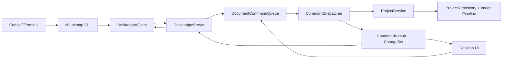

# Phase 6: Desktop Command Host 与 DocumentCommandQueue

状态：已实现（`0.6.0-phase6`）

本文定义 Phase 6 的架构改造。它覆盖并替代
[CODE_ARCHITECTURE_DESIGN.md](./CODE_ARCHITECTURE_DESIGN.md) 中关于
`ProjectWatcher`、event 文件和 CLI 直接调用 `ProjectService` 的设计。

## 1. 前提

Phase 6 采用一个明确前提：

> 使用 `chunkmap` CLI 时，Desktop App 一定已经运行。

Desktop 是唯一常驻的 document host，也是正式项目文件的唯一写入进程。CLI 只是一个
轻量本地 IPC client，不具备直接修改项目的能力。

这意味着：

- Desktop 未运行时，CLI 返回 `desktop_not_running`。
- Desktop 运行时，所有 CLI command 都进入 Desktop 内置的 DocumentCommandQueue。
- Desktop UI 自己的修改也进入同一 queue。
- 不需要 `ProjectWatcher`、events 或第二条写入通路。
- Desktop 采用单实例；不会同时存在两个 document host。

## 2. 核心决策

所有正式项目写入必须经过：

```text
Desktop DocumentCommandQueue -> CommandDispatcher -> ProjectService -> ProjectRepository
```

CLI 不直接调用 `ProjectService`，Desktop Panel 也不直接写项目文件。

这里的 `DocumentCommandQueue` 不是 AI 生成队列：

- 不持久化。
- 不显示进度。
- 不创建 Generating 状态。
- 不保存 command history。
- 不提供 undo/redo。
- 不包含图片候选、审批或版本。

它只保证 Desktop 用户操作和 CLI 操作按确定顺序修改 document。

## 3. 不变量

1. `project.json`、`concept/` 和 `chunks/` 的正式写入只能发生在
   `CommandDispatcher` 内。
2. `CommandDispatcher` 只能由 Desktop `DocumentCommandQueue` 调用。
3. Desktop App 是单实例，进程内只有一条 document queue。
4. 所有 command，包括查询和派生输出，都按 queue 顺序执行。
5. CLI 只负责参数解析、IPC request 和输出格式化。
6. Desktop 未运行时 CLI 不修改任何项目文件。
7. CLI 与 Desktop UI 使用相同 typed command 和相同 Dispatcher。
8. 文件仍是持久化真相；queue 不是数据库或 event log。
9. 不增加 revision conflict、neighbor hash、候选图或版本历史。
10. AI 生图仍由 Codex subscription 完成，Desktop 不调用生图 API。

### 3.1 编译期边界

“必须经过 queue”不能只依赖 code review：

- Desktop Panel 和 CLI 只 include CommandHost / CommandClient public headers。
- `CommandDispatcher::execute()` 对普通调用者不可见，只允许
  `DocumentCommandQueue` 调用。
- 产品入口不 include `ProjectService`；architecture test 禁止 Desktop Panel 和 CLI
  直接引用它。Core 低层测试仍可直接覆盖 service primitive。
- `ProjectRepository::save()` 和 `atomic_file::write_*()` 不暴露给 Desktop Panel 或 CLI。
- Architecture test 扫描 Desktop Panel 和 CLI sources，禁止 include internal mutation
  headers 或调用文件写 API。

Core 的低层单元测试仍可直接测试 image/repository primitive；产品入口 integration tests
必须从 queue 或 IPC client 提交 command。

## 4. 总体架构



Desktop 不执行 CLI 子进程。CLI 不创建 ImGui、GLFW 或 OpenGL。二者共享 typed command
protocol，但所有业务执行都发生在 Desktop process。

## 5. Command Model

### 5.1 CommandRequest

Core 内使用结构化 command，不传递原始 `argv`：

```cpp
enum class CommandType {
    ProjectCreate,
    ProjectStatus,
    ProjectValidate,
    ChunkImport,
    ConceptContext,
    PromptsImport,
    PromptShow,
    PromptSet,
    ChunkContext,
    ChunkWrite,
    ChunkShow,
    ChunkRemove,
    Render,
    SeamInspect,
    MapExport,
};

struct CommandRequest {
    std::string request_id;
    CommandType type;
    std::filesystem::path workspace;
    std::optional<std::string> project_name;
    CommandPayload payload;
};
```

`CommandPayload` 使用 `std::variant` 保存 typed payload，例如 `ProjectCreatePayload`、
`ChunkImagePayload` 和 `PromptSetPayload`。CommandDispatcher 不再次解析字符串参数。

### 5.2 CommandResult

```cpp
struct ChangeSet {
    ProjectKey project;
    bool project_changed = false;
    bool composite_changed = false;
    bool concept_changed = false;
    std::vector<ChunkCoord> changed_chunks;
    std::vector<ChunkCoord> changed_prompts;
    std::vector<SeamKey> changed_seams;
    std::vector<std::filesystem::path> changed_contexts;
};

struct CommandResult {
    nlohmann::json data;
    ChangeSet changes;
};
```

失败继续使用 `Result<CommandResult>` 和稳定的 `Error {code, message}`。

`ChangeSet` 只描述一次 command completion 影响哪个项目、需要刷新什么，不是 revision、
event log 或历史记录。它只存在于内存和单次 IPC response 中。

### 5.3 正式写命令

以下命令修改正式项目 document：

- `ProjectCreate`
- `ChunkImport`
- `PromptsImport`
- `PromptSet`
- `ChunkWrite`
- `ChunkRemove`

未来增加 Project Settings 修改时，也必须增加 typed command，不能让 Panel 直接保存
`project.json`。

### 5.4 查询和派生命令

以下命令不修改正式 document，但仍进入同一 queue，以保证顺序和错误合同一致：

- `ProjectStatus`
- `ProjectValidate`
- `PromptShow`
- `ChunkShow`
- `ConceptContext`
- `ChunkContext`
- `Render`
- `SeamInspect`
- `MapExport`

`context/` 和 `cache/` 仍是可重建派生数据。

## 6. DocumentCommandQueue

Desktop 持有唯一 queue 和一个 command worker：

```cpp
class DocumentCommandQueue {
public:
    CommandFuture submit(CommandRequest request);
    void stop_and_drain();
};
```

执行流程：

1. Desktop UI 或 IPC Server 提交 typed request。
2. Queue 在唯一 worker 上依次调用 `CommandDispatcher::execute()`。
3. Command 完成后把 result 放入 main-thread completion queue。
4. `App::draw()` 在帧开始消费 completion。
5. App 根据 `ChangeSet` 更新 Project snapshot、Prompt buffer 和 TextureCache。
6. IPC request 等待 result，然后回复 CLI。

图片解码、Composite 和 Seam 构建不阻塞 ImGui main thread。OpenGL texture 创建和销毁仍
只发生在 main thread。

### 6.1 顺序

Desktop UI 与 CLI command 使用同一 FIFO：

```text
UI PromptSet A
CLI PromptSet B
CLI PromptShow
```

结果必须是 B。queue 顺序就是 last writer wins，不增加 revision 或 conflict dialog。

### 6.2 Error isolation

- 一个 command 返回 Error 后，queue 继续执行后续 command。
- Dispatcher 捕获 filesystem、JSON 和 image 异常并转换为 Error。
- Command 失败不能让 IPC worker 或 Desktop process 退出。
- 正式文件继续使用临时文件加原子替换。

### 6.3 Shutdown

Desktop 正常退出时：

1. IPC Server 停止接受新 request。
2. Prompt editor 提交最后一个 `PromptSet`。
3. Queue drain 已接受 command。
4. App 消费剩余 completion。
5. 销毁 textures、ImGui、OpenGL 和 GLFW。
6. 删除本地 IPC endpoint。

## 7. CommandDispatcher

`CommandDispatcher` 是唯一允许调用 `ProjectService` mutation API 的 application 入口：

```cpp
class CommandDispatcher {
    friend class DocumentCommandQueue;

private:
    explicit CommandDispatcher();
    Result<CommandResult> execute(const CommandRequest& request);
};
```

职责：

- 校验 command type 与 payload。
- 根据 request workspace/project 打开或创建 Project。
- 调用 `ProjectService`。
- 把 Service result 转成稳定 command data。
- 计算最小且精确的 `ChangeSet`。
- 转换所有业务和 IO 错误。

不负责：

- 解析 CLI `argv`。
- 格式化 stdout。
- 管理 IPC bytes。
- 创建 ImGui/OpenGL 对象。
- 管理 AI 生成状态。
- 保存 undo/redo history。

Phase 6 后，`CliApp::run_*` 不再构造 `ProjectService`。Desktop Panel 也不直接调用
`ProjectService::write_prompt()`、`import_chunk_image()` 或其他 mutation API。

## 8. Desktop 单实例与 IPC

### 8.1 单实例

Desktop App 是当前用户的单实例 document host：

- 第一个 Desktop instance 创建本地 IPC endpoint。
- 第二个 instance 发现 endpoint 可连接后退出，并提示 App 已运行。
- 第一版不支持两个 Desktop process 分别管理不同项目。
- 一个 Desktop process 可以通过 command request 操作任意 workspace/project，但 UI 只显示
  当前打开项目。

所有正式业务执行天然集中在唯一 Desktop process 和唯一 queue，不再设计额外的跨进程
document ownership 层。

### 8.2 Transport

- macOS/Linux：当前用户 runtime directory 中的固定 Unix domain socket。
- Windows：带当前用户 ACL 的固定 Named Pipe。

不开放 TCP port，不监听网络接口，不要求防火墙权限。

Unix socket 路径使用短固定名称，避免平台 socket path 长度限制。Desktop 启动时若发现
残留 socket：

1. 先尝试连接。
2. 可连接表示已有 Desktop，当前 instance 退出。
3. 不可连接表示 stale socket，删除后重新 bind。

### 8.3 IPC Protocol

每条消息使用 length-prefixed UTF-8 JSON，不依赖换行作为 message boundary：

```json
{
  "protocol_version": 1,
  "request_id": "42",
  "command": "chunk write",
  "workspace": "/repo",
  "project": "my-world",
  "payload": {
    "coord": [1, 2],
    "image": "/tmp/generated.png"
  }
}
```

Response：

```json
{
  "protocol_version": 1,
  "request_id": "42",
  "result": {
    "schema_version": 1,
    "ok": true,
    "command": "chunk write",
    "project": "my-world",
    "data": {}
  },
  "changes": {
    "composite_changed": true,
    "changed_chunks": [[1, 2]],
    "changed_seams": []
  }
}
```

CLI 只把 `result` envelope 输出到 stdout，保证 Phase 5 JSON contract 不变。`changes` 由
Desktop 自己消费，不输出给普通 CLI 用户。

### 8.4 Desktop 未运行

CLI 连接 endpoint 失败时：

```json
{
  "schema_version": 1,
  "ok": false,
  "command": "chunk write",
  "project": "my-world",
  "error": {
    "code": "desktop_not_running",
    "message": "AI Chunk Map Studio must be running before using chunkmap CLI."
  }
}
```

CLI 返回非零，不创建本地 Dispatcher，不修改文件，也不尝试自动启动 Desktop。

### 8.5 Timeout 与中断

- Connect timeout 只用于快速判断 Desktop 未运行。
- 图片写回和 Composite 可以较慢，不使用几秒级 command timeout。
- CLI 等待期间不输出伪进度。
- 用户中断 CLI 只取消等待；已经进入 Desktop queue 的 command 继续完成。

## 9. 多项目行为

CommandRequest 总是携带 canonical workspace path 和 project name。

- Command 针对 Desktop 当前 `ProjectKey`：完成后应用 `ChangeSet` 并立即刷新 UI。
- Command 针对另一个已有项目：仍在同一 queue 执行，但 App 忽略其 UI invalidation，
  不切换当前项目。
- `ProjectCreate`：创建成功后 Desktop 自动打开新项目，与 New Project modal 行为一致。
- Desktop 的 Open Project 仍是 UI 操作；它提交读取 command 后切换当前 snapshot。

Project path 使用共享 `ProjectKey` helper 规范化，避免相对路径和 symlink 产生不同身份：

```text
ProjectKey = normalized weakly-canonical workspace path + validated project name
```

Windows 额外规范化盘符和大小写。

## 10. Desktop UI 更新

Phase 6 删除 `ProjectWatcher`。App 每帧只处理 command completion：

```text
drain CommandCompletionQueue
  -> project_changed: reload Project snapshot
  -> changed_prompts: update selected Prompt when relevant
  -> changed_chunks: invalidate exact chunk textures
  -> composite_changed: invalidate Composite texture
  -> changed_seams: invalidate exact Seam textures
draw UI
```

### 10.1 Prompt Editor

- debounce 到期后提交 `PromptSet` command。
- 切换 chunk、失焦和关闭项目时提交并等待当前 Prompt command。
- 外部 CLI `prompt set` / `prompts import` 进入同一 queue。
- Command completion 精确更新 editor buffer。
- UI 不调用 `atomic_file::write_text()` 或 `ProjectService::write_prompt()`。

### 10.2 Texture 更新

TextureCache 不轮询 mtime。只有 `ChangeSet` 或手动 Reload 可以 invalidate texture。

`ChunkWrite` 完成前 Desktop 继续显示旧正式图；完成后同一帧切换到新图和新 Composite，
不显示半完成状态。

### 10.3 手动 Reload

保留 Reload command，用于 Git、同步工具或调试期间的直接文件修改。手工改文件不属于正式
编辑流程，Desktop 不保证自动发现。

## 11. 文件与 Event 变化

Phase 6 后：

- 停止创建和追加 `events/events.jsonl`。
- 删除 `EventWriter` 和 `ProjectWatcher`。
- 新项目不再创建 `events/`。
- 旧项目已有 `events/` 可以保留，Core 忽略它。
- `project.json`、`concept/`、`chunks/`、`context/` 和 `cache/` 格式不变。
- IPC endpoint 位于系统用户 runtime directory，不属于项目数据。

## 12. CLI 架构

CLI 新调用链：

```text
main
  -> CommandParser
  -> typed CommandRequest
  -> DesktopIpcClient
  -> OutputWriter
```

公开命令和参数保持不变。删除生产代码中的 CLI 本地 `ProjectService` 调用。

不增加 `--headless`、`--local` 或绕过 Desktop queue 的参数。

## 13. 建议代码结构

```text
src/
  command/
    command_type.h
    command_request.h
    command_result.h
    command_codec.h/.cpp
    command_dispatcher.h/.cpp
    document_command_queue.h/.cpp
  ipc/
    desktop_ipc_client.h/.cpp
    desktop_ipc_server.h/.cpp
    unix_socket_transport.cpp
    windows_named_pipe_transport.cpp
  project/
    project_key.h/.cpp
    project_service.h/.cpp
    project_repository.h/.cpp

desktop/src/
  app.h/.cpp
  command_completion.h/.cpp
  desktop_command_host.h/.cpp
  single_instance.h/.cpp
  # 删除 project_watcher.h/.cpp

cli/src/
  command_parser.h/.cpp
  cli_app.h/.cpp
  output_writer.h/.cpp
```

IPC transport 只负责 bytes。Command codec、Dispatcher 和 Queue 仍属于无 UI Core。

## 14. 实施顺序

以下 6.1 至 6.5 已完成。当前自动化覆盖 typed codec、FIFO、单实例、在线 CLI
工作流、离线零写入和 Desktop smoke；Windows transport 已实现，仍需 Windows CI 实机验证。

### Phase 6.1 Typed Command 与 Dispatcher

- 为全部现有 CLI 命令定义 typed payload。
- 把 `CliApp::run_*` 业务逻辑迁入 `CommandDispatcher`。
- Dispatcher 返回 `CommandResult + ChangeSet`。
- 先用 queue integration tests 锁定 Phase 5 command 语义。

### Phase 6.2 Desktop Command Queue

- Desktop 创建唯一 `DocumentCommandQueue`。
- Desktop UI mutation 改为提交 command。
- 增加顺序、错误隔离和 shutdown drain 测试。

### Phase 6.3 Local IPC

- 实现 Unix socket 和 Windows Named Pipe。
- Desktop 启动 IPC Server 并强制单实例。
- CLI 改为只发送 IPC request。
- Desktop 未运行时返回 `desktop_not_running`。

### Phase 6.4 精确刷新

- App 消费 `ChangeSet`。
- Prompt、chunk、composite 和 seam texture 精确 invalidation。
- 删除 `ProjectWatcher` 和 events writer。

### Phase 6.5 Hardening

- IPC 与直接 queue execution result parity。
- CLI 中断时 Desktop command completion。
- stale Unix socket 和 Windows Named Pipe cleanup。
- 含空格和非 ASCII workspace/image path。
- macOS、Windows transport integration tests。

## 15. 测试计划

### 15.1 Dispatcher Contract

对每个 command 验证：

- typed payload 校验。
- 与 Phase 5 CLI 相同的 data 和 error code。
- 正确且最小的 `ChangeSet`。
- mutation 只发生一次。
- Desktop/CLI architecture test 禁止直接调用 ProjectService mutation/file write API。

### 15.2 Queue

- `PromptSet A -> PromptSet B -> PromptShow` 必须返回 B。
- `ChunkWrite -> Render -> ChunkShow` 严格按提交顺序。
- 一个 command 失败后，后续 command 继续执行。
- shutdown drain 不丢失已接受的正式写入。
- Desktop UI command 与 CLI command 共享 FIFO。

### 15.3 IPC

- Desktop Server 运行时，所有现有 CLI 命令通过 IPC 成功。
- Desktop 未运行时返回稳定的 `desktop_not_running` JSON。
- 第二个 Desktop instance 不能创建第二个 command host。
- IPC result 与直接 queue integration test 逐字段一致。
- CLI 断开后，已入队 command 仍完成。

### 15.4 Desktop

- IPC `PromptSet` 完成后 editor buffer 立即更新。
- IPC `ChunkWrite` 完成后精确替换 chunk、Composite 和 Seam texture。
- 针对非当前项目的 CLI command 不切换 UI。
- `ProjectCreate` command 创建后自动打开新项目。
- 不存在 watcher polling 和 `events.jsonl`。
- 手动 Reload 仍能恢复外部文件修改。

## 16. 验收标准

- 所有正式写入都能追溯到 Desktop `DocumentCommandQueue` 中的一条 command。
- Desktop 用户操作和 CLI 操作调用同一个 Dispatcher。
- Codex 运行现有 CLI 命令后 App 立即更新，不经过文件轮询。
- Desktop 未运行时 CLI 明确失败且不修改项目。
- CLI JSON contract 与 Phase 5 保持兼容。
- 第二个 Desktop instance 不会创建第二条 document queue。
- `ProjectWatcher`、event writer 和 `events.jsonl` 通知链路被删除。
- 用户界面仍不存在 AI 任务、生成队列、候选版本和 Accept 流程。

## 17. 明确不做

- 不支持 CLI 直接修改项目文件。
- 不支持多个 Desktop process。
- 不做网络远程控制或 HTTP port。
- 不持久化 command queue。
- 不做 undo/redo 或 replay history。
- 不把 AI 图片生成放进 Desktop。
- 不增加候选图、审批、版本和任务进度。
