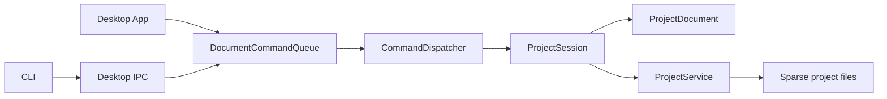

# ChunkMap Studio 源码快速导览

目标：用最短路径建立“谁持有状态、命令怎么走、图片怎么落盘、地图怎么画”的模型。
完整架构见 [CODE_ARCHITECTURE_DESIGN.md](./CODE_ARCHITECTURE_DESIGN.md)。

## 1. 一张图理解系统



最重要的边界：Desktop 是唯一 document host；CLI 不直接写项目。Queue 串行执行
Desktop 与 CLI 的 typed commands。Session 中的内存文档是运行时权威，磁盘是持久化
边界。

## 2. 先读数据模型

1. `src/model/chunk_coord.h`：坐标与稳定文件名 `<x>_<y>`。
2. `src/model/project_config.h`：grid、可选 chunk size、overlap ratio。
3. `src/project/project_paths.h/.cpp`：正式路径与 workspace handoff 路径。
4. `src/model/project.h`：config + paths 的轻量组合。
5. `src/model/project_document.h/.cpp`：常驻 Prompt/Ready 状态与 lazy ImageBuffer。
6. `src/project/project_session.h/.cpp`：当前 workspace/service/document 生命周期。

磁盘项目只有：

```text
project.json
concept.png
global_prompt.md       # optional, non-empty
prompts/<x>_<y>.md     # sparse
chunks/<x>_<y>.png     # Ready only
```

`ProjectDocument::load()` 只扫描一次 Prompt 与 Ready 文件；不在打开时解码所有 Chunk。
`ProjectDocument::image()` 才执行 lazy PNG decode。

## 3. 跟一条 Prompt 命令

推荐以 `prompt set` 为第一条完整调用链：

1. `cli/src/cli_app.cpp` 构造 `CommandRequest`；
2. `src/command/command_codec.cpp` 编解码 IPC JSON；
3. `src/ipc/desktop_ipc.cpp` 把请求送给运行中的 Desktop；
4. `src/command/document_command_queue.cpp` FIFO 执行；
5. `src/command/command_dispatcher.cpp` 从 `ProjectSession` 取得同一个 document；
6. `ProjectService::write_prompt()` 原子写入或删除 sparse file；
7. Dispatcher 更新 `ChunkDocument::prompt` 并发布 `changed_prompts`。

再看 `prompt show`：它直接读 `ProjectDocument`，不重新打开项目或读取 Prompt 文件。
`ProjectOpen` 是显式 Reload，会重新构造整个 document。

## 4. 跟一张 Chunk 图片

入口都在 `ProjectService::store_chunk_image()`：

```text
decode input
  -> initialize/check chunk size
  -> deterministic 1px normalization
  -> generated write restores opaque protected pixels from fresh template
  -> atomic write chunks/<x>_<y>.png
  -> update one ChunkDocument
  -> upload the same in-memory ImageBuffer to one Desktop texture
```

`chunk import` 不要求邻居；`chunk write` 要求至少一个 Ready 正交邻居。两者成功后都是
普通 Ready chunk。代码不会构建 Composite、metadata 或 Seam cache。

继续阅读：

- `src/image/image_buffer.*`：RGBA8 + stb PNG；
- `src/image/image_pipeline.*`：geometry、Concept slicing、normalization、template；
- `src/image/seam_analyzer.*`：纯内存 Seam metrics/previews；
- `desktop/src/gl_texture.*`：按需 texture cache 与内存直传。

## 5. Context handoff

`ProjectService::export_concept_context()` 临时切 Concept regions；
`export_chunk_context()` 生成 template/mask/prompt/manifest。输出都在：

```text
<workspace>/.chunkmap/handoff/<project>/
```

它们不是项目状态。Concept crop 只辅助规划 Prompt；详细 Chunk 生成只把 Ready 邻居作为
图片约束。

## 6. Desktop 地图

阅读 `desktop/src/app.cpp` 时优先找：

- `draw_map()`：按 `(y, x)` 顺序逐张画 Chunk，Empty 使用 Concept UV；
- `poll_commands()`：处理异步 import 与 CLI completion，只失效局部 texture；
- `import_image()`：提交异步 command，不阻塞 frame loop；
- `refresh_seam()`：把内存 preview 直接上传 texture；
- `apply_project_snapshot()`：create/open/reload 时替换 UI snapshot 和 cache。

地图尺寸与 overlap 命中规则在 `src/ui/map_geometry.*`，不需要整张 CPU 或 GPU Composite。

## 7. 推荐阅读顺序

第一轮（30 分钟）：

1. `project_config.h`
2. `project_paths.*`
3. `project_document.*`
4. `project_session.*`
5. `document_command_queue.cpp`
6. `command_dispatcher.cpp` 中 PromptShow/PromptSet

第二轮（图片）：

1. `ProjectService::store_chunk_image()`
2. `image_pipeline.*`
3. `export_chunk_context()`
4. `SeamAnalyzer::analyze()`
5. Desktop `draw_map()` 与 `poll_commands()`

第三轮（边界与验证）：

1. `project_repository.cpp` 的 schema v1→v2 migration
2. `command_codec.cpp`
3. `desktop_ipc.cpp`
4. `tests/test_project_service.cpp`
5. `tests/test_command_system.cpp`
6. `tests/phase3_cli_test.cmake`

读完应能回答：为什么 CLI 离线不能写；为什么外部文件修改不会自动进入 session；为什么
上传一张图只改变一个正式 PNG、一个 ChunkDocument 和一个 texture。
