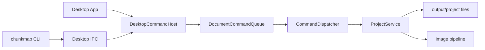
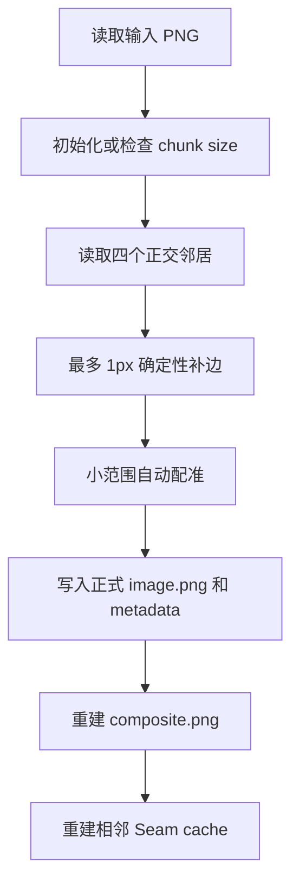

# ChunkMap Studio 源码快速导览

这份文档面向准备直接阅读源码的开发者。它不重复完整产品设计，而是回答四个问题：

1. 程序由哪些部分组成？
2. 一条命令如何穿过系统？
3. 地图图片如何进入、处理并落盘？
4. 应该按什么顺序阅读源码？

## 1. 先建立整体模型

ChunkMap Studio 是一个 C++17 项目，包含三个主要 target：

| Target | 入口 | 职责 |
|---|---|---|
| `chunkmap_core` | 无单独入口 | 命令系统、项目读写、图片处理、IPC、地图几何 |
| `chunkmap_desktop` | `desktop/src/main.cpp` | Dear ImGui 界面，也是唯一 document host |
| `chunkmap` | `cli/src/main.cpp` | 解析 CLI 参数，通过 IPC 向 Desktop 提交命令 |

最重要的系统边界是：**Desktop 持有唯一的命令队列，CLI 不直接修改项目文件。**



`DocumentCommandQueue` 只是内部 FIFO 串行器，不是 AI 生成任务队列，也不保存历史或提供 undo/redo。

## 2. 核心数据模型

数据模型很小，建议首先读完。

### `ChunkCoord`

文件：`src/model/chunk_coord.h`

一个 `(x, y)` 坐标。地图左上角是 `(0, 0)`，x 向右、y 向下。

### `ProjectConfig`

文件：`src/model/project_config.h`

保存项目的持久化配置：

- schema version；
- 项目名；
- columns 和 rows；
- 可选的 chunk width/height；
- 水平、垂直 overlap ratio；
- feather ratio。

新项目最初没有 chunk 尺寸。第一次 `chunk import` 后，导入图片的尺寸成为全项目尺寸。

### `Project`

文件：`src/model/project.h`

`Project` 只是两个对象的组合：

```cpp
struct Project {
    ProjectConfig config;
    ProjectPaths paths;
};
```

它不是一个带大量行为的领域对象。行为集中在 `ProjectService`，文件位置集中在 `ProjectPaths`。

### `ProjectPaths`

文件：`src/project/project_paths.h/.cpp`

这是理解磁盘布局的权威入口。不要在其他代码中猜文件名。

一个项目大致保存为：

```text
output/<project-name>/
├── project.json
├── concept/
│   ├── source.png
│   └── regions/<x,y>.png
├── chunks/
│   └── <x,y>/
│       ├── prompt.md
│       ├── image.png
│       └── metadata.json
├── context/
│   ├── concept/
│   └── chunk_<x,y>/
└── cache/
    ├── composite.png
    └── seams/
```

正式状态没有独立枚举。`image.png` 存在即为 Ready，不存在即为 Empty。

## 3. 命令系统

命令系统是 Desktop 与 CLI 共用业务行为的关键。

### 3.1 请求：`CommandRequest`

文件：`src/command/command_request.h`

请求包含：

- `request_id`：区分 Desktop 和 CLI 请求；
- `CommandType`：命令类型；
- `workspace`；
- 可选项目名；
- typed `CommandPayload` variant。

例如 `ChunkWrite` 携带 `ChunkImagePayload`，而 `PromptSet` 携带 `PromptSetPayload`。这避免 Dispatcher 处理随意结构的 JSON。

### 3.2 排队：`DocumentCommandQueue`

文件：`src/command/document_command_queue.h/.cpp`

`submit()` 把请求放进 `pending_`，后台 worker 按 FIFO 顺序调用 Dispatcher。调用方通过 `future` 等待结果；Desktop 还可以通过 `take_completions()` 获取完成记录并刷新 UI。

### 3.3 分发：`CommandDispatcher`

文件：`src/command/command_dispatcher.cpp`

它负责命令层工作：

- 检查 payload 类型和必需的项目名；
- 打开项目；
- 调用对应的 `ProjectService` 方法；
- 把领域结果转换为 CLI JSON/text；
- 构造供 Desktop 刷新的 `ChangeSet`。

`CommandDispatcher::execute()` 是 private，只有 `DocumentCommandQueue` 是 friend。这个结构表达了“正式命令必须排队”的约束。

### 3.4 结果：`CommandResult` 和 `ChangeSet`

文件：`src/command/command_result.h`

`CommandResult` 同时服务两类消费者：

- CLI 使用 `data` 和 `text`；
- Desktop 使用 `changes`、可选的 `project_snapshot` 和 `seam_analysis`。

`ChangeSet` 不携带新的完整 UI 状态，只描述什么发生了变化，例如：

- 哪些 chunk 或 prompt 改变；
- Composite 是否改变；
- 哪些 Seam 或 context 改变；
- 项目配置是否改变。

## 4. CLI 与 IPC

### CLI

入口文件：

- `cli/src/main.cpp`
- `cli/src/command_parser.cpp`
- `cli/src/cli_app.cpp`

`command_parser` 只处理全局参数，`CliApp` 再按 command/subcommand 构造 typed request。`CliApp::execute()` 不创建 `ProjectService`，而是使用 `DesktopIpcClient::send()`。

`--help` 和 `--version` 可以本地执行；项目命令要求 Desktop 正在运行。

### IPC

文件：`src/ipc/desktop_ipc.h/.cpp`

传输层在 Unix/macOS 使用 Unix domain socket，在 Windows 使用 named pipe。消息格式是：

```text
4-byte little-endian payload length
JSON payload
```

`command_codec.h/.cpp` 负责 typed C++ request/result 与 JSON envelope 之间的转换。

Desktop 侧的 `DesktopCommandHost` 同时持有：

- 唯一的 `DocumentCommandQueue`；
- 接受 CLI 请求的 `DesktopIpcServer`。

因此 Desktop UI 和 CLI 最终调用的是同一个 queue 实例。

## 5. 业务中心：`ProjectService`

文件：`src/project/project_service.h/.cpp`

这是项目的业务中心，主要职责可以分成四组：

| 分组 | 主要方法 |
|---|---|
| 项目生命周期 | `create_project`、`open_project`、`status`、`validate` |
| Prompt | `read_prompt`、`write_prompt`、`import_prompts` |
| Context | `export_concept_context`、`export_chunk_context` |
| 正式图片 | `import_chunk_image`、`write_chunk_image`、`remove_chunk_image`、`rebuild_composite`、`inspect_seam` |

`ProjectRepository` 只负责 `project.json` 的序列化；`ProjectService` 负责跨文件的业务流程。

### `chunk import` 与 `chunk write`

两者最终都进入私有方法 `store_chunk_image()`，区别由两个布尔契约控制：

| 操作 | 可初始化项目尺寸 | 必须存在 Ready 正交邻居 |
|---|---:|---:|
| `chunk import` | 是 | 否 |
| `chunk write` | 否 | 是 |

共同管线为：



用户导入图和 AI 生成图一旦写入成功，就没有来源身份差异，都是普通 Ready chunk。

## 6. 图片管线

### `ImageBuffer`

文件：`src/image/image_buffer.h/.cpp`

统一的 RGBA8 CPU 图片容器，封装 PNG 加载、编码、裁切和 blit。底层使用 stb。

### `image_pipeline`

文件：`src/image/image_pipeline.h/.cpp`

包含三个相互独立的算法：

- `ConceptSlicer`：按 columns/rows 切分 Concept Map；
- `TemplateBuilder`：从 Ready 正交邻居复制 overlap，构造生图模板；
- `ImageNormalizer`：允许输入每个维度最多少 1px，并根据邻居误差选择补在哪一侧。

`image_geometry()` 把比例配置转换成 overlap、step 和 feather 像素数。

### 自动配准

文件：`src/image/image_registration.h/.cpp`

`ImageRegistration::align()` 在有限平移范围内比较候选图和所有 Ready 邻居的 overlap。评分结合结构差异、颜色差异和位移惩罚；改善不足或最佳点落在搜索边界时不会应用平移。

### Composite 与 Seam

文件：

- `src/image/composite_builder.cpp`
- `src/image/seam_analyzer.cpp`

Composite 根据 step 把所有 Ready chunk 合成一张地图，并在 overlap 区域做 feather。Seam Analyzer 针对一对水平或垂直相邻 chunk，产生：

- mean absolute RGB difference；
- overlap preview；
- difference preview。

## 7. Desktop UI

入口：`desktop/src/main.cpp`

`main.cpp` 只负责 GLFW、OpenGL 和 ImGui 生命周期。真正的 UI 和 session state 都在 `desktop/src/app.h/.cpp` 的 `App` 中。

`App::draw()` 每帧依次：

1. 处理 CLI 命令 completion；
2. 绘制 DockSpace；
3. 绘制 Toolbar；
4. 绘制地图；
5. 绘制 Inspector 和 modal；
6. 到期时自动保存 Prompt。

主要 UI 状态包括：

- 当前 `Project` snapshot；
- 当前选中坐标；
- prompt buffer 和 dirty flag；
- zoom/pan；
- 纹理缓存；
- 当前 Seam 分析结果。

地图画布不拥有项目数据。点击、导入、保存 Prompt 等动作都会构造 `CommandRequest` 并交给 `DesktopCommandHost`。

`poll_commands()` 只处理 CLI 来源的 completion；Desktop 自己同步等待的命令通过 `desktop-` request id 被过滤掉。

## 8. 推荐阅读顺序

不要一开始顺序阅读整个 `project_service.cpp`。建议按下面五轮阅读。

### 第一轮：数据和磁盘布局

1. `src/model/chunk_coord.h`
2. `src/model/project_config.h`
3. `src/model/project.h`
4. `src/project/project_paths.h/.cpp`
5. `src/project/project_repository.cpp`

读完应能回答：一个项目在内存和磁盘上分别是什么。

### 第二轮：最短命令链

以 `prompt show` 或 `prompt set` 为例：

1. `cli/src/cli_app.cpp`
2. `src/command/command_request.h`
3. `src/command/command_codec.cpp`
4. `src/ipc/desktop_ipc.cpp`
5. `src/command/document_command_queue.cpp`
6. `src/command/command_dispatcher.cpp`
7. `ProjectService::read_prompt/write_prompt`

读完应能回答：CLI 为什么不能绕过 Desktop 写文件。

### 第三轮：图片主流程

从 `ProjectService::store_chunk_image()` 开始，遇到调用再跳转到：

1. `ImageNormalizer::normalize`
2. `ImageRegistration::align`
3. `CompositeBuilder::build`
4. `ProjectService::inspect_seam`
5. `SeamAnalyzer::analyze`

读完应能回答：一张输入图如何成为正式 chunk，并影响整张地图。

### 第四轮：Context 交接

阅读：

1. `ProjectService::export_concept_context`
2. `ProjectService::export_chunk_context`
3. `TemplateBuilder::build`
4. 对应的 manifest JSON 生成代码。

读完应能区分：Concept Context 用于写 Prompt，Chunk Context 用于生成详细图片。

### 第五轮：Desktop

1. `desktop/src/main.cpp`
2. `desktop/src/desktop_command_host.cpp`
3. `App::draw`
4. `App::draw_map`
5. `App::draw_inspector`
6. `App::poll_commands`
7. `desktop/src/gl_texture.cpp`

读完应能回答：Desktop 如何展示 Core 状态，以及 CLI 修改如何刷新到界面。

## 9. 测试如何对应架构

| 测试 | 重点 |
|---|---|
| `test_project_service.cpp` | 项目、Prompt、Context 和 chunk 业务契约 |
| `test_image_pipeline.cpp` | 切片、模板、归一化和 Composite |
| `test_image_registration.cpp` | 自动配准 |
| `test_golden_images.cpp` | 确定性的模板和 Composite 像素布局 |
| `test_command_system.cpp` | typed codec、FIFO queue、IPC 单实例 |
| `test_phase6_architecture.cpp` | 防止 CLI/Desktop 恢复直接写入旁路 |
| `phase2_cli_test.cmake` | 项目与 Prompt CLI 流程 |
| `phase3_cli_test.cmake` | chunk/context/render/seam CLI 流程 |

遇到不确定的行为时，先找 `test_project_service.cpp` 和相关图片测试。它们通常比 UI 代码更直接地表达当前契约。

## 10. 阅读时始终记住的边界

- Desktop 是唯一 document host。
- CLI 只通过 IPC 提交 typed command。
- 正式 mutation 的调用链是 `Queue -> Dispatcher -> ProjectService`。
- Concept 图只用于理解布局和生成文字 Prompt。
- 详细 chunk 的图片 context 只来自 Ready 邻居。
- chunk 只有 Empty/Ready，没有候选、审批和历史状态。
- `import` 可建立孤立锚点；`write` 必须有 Ready 正交邻居。
- Context、Composite 和 Seam 都是可重建派生物；`project.json`、Prompt 和正式 chunk 图片是项目的核心内容。
