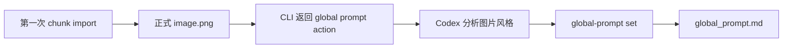

# Global Prompt 设计

> 历史文档：该设计已实现，当前行为以 README 与当前架构文档为准。

状态：已实现

## 1. 目标

在现有每个 chunk 独立 Prompt 的基础上，增加一份项目级 Global Prompt，用来统一整张地图的视觉风格。

Global Prompt 负责描述：

- 美术媒介和年代感，例如 GBA 时代的俯视像素地图；
- 镜头、比例和透视规则；
- 色板、光照、阴影和像素边缘；
- 树木、建筑、道路、水体等元素共同遵守的表现方式；
- 全局禁止项，例如文字、水印、写实渲染或不一致的镜头角度。

每个 Chunk Prompt 继续只描述该区域的内容和布局。两者在导出 chunk generation context 时组合，不互相覆盖。

```text
Global Prompt：整张地图应当以什么风格呈现
Chunk Prompt：这个坐标具体应当画什么
```

## 2. 产品边界

本功能遵守当前产品边界：

- Desktop 仍然不调用 AI；
- CLI 仍然只是 Desktop IPC client；
- 正式修改仍经过 `DocumentCommandQueue -> CommandDispatcher -> ProjectService`；
- 不增加 Seed provenance、图片来源、风格版本或生成任务；
- 不把某张图片永久标记为 Style Reference；
- 用户可以随时直接编辑 Global Prompt。

Global Prompt 的初始内容可以由 Codex 根据第一张正式图片生成，但生成完成后，它就是一份普通的项目级文本，不再依赖 Seed 图片。

## 3. 文件布局

新增文件：

```text
output/<project-name>/global_prompt.md
```

项目创建时写入空文件。它不放进 `project.json`，因为：

- `project.json` 继续只保存结构化配置；
- Prompt 是用户会频繁编辑的长文本；
- 它与现有 `chunks/<x,y>/prompt.md` 形成清晰的项目级和区域级对应。

`ProjectPaths` 增加：

```cpp
std::filesystem::path global_prompt() const;
```

Global Prompt 允许为空，空内容表示尚未设置全局风格。为兼容本功能实现前创建的项目，文件缺失也按空 Global Prompt 读取；第一次编辑会创建文件。新项目始终预创建该文件。

## 4. 第一张图片作为隐式 Seed

采用方案 A：第一张正式图片只在初始化时隐式作为 Seed，不保存它的身份。

完整语义如下：

1. 新项目的 `global_prompt.md` 为空。
2. 第一次成功执行 `chunk import` 时，该图片同时确定项目 chunk 尺寸。
3. CLI 成功结果明确告诉调用它的 AI：应分析这张正式图片并写入 Global Prompt。
4. AI 写入 Global Prompt 后，不保存 Seed 坐标或图片来源。
5. 后续导入或替换图片不会自动修改 Global Prompt。
6. 用户不满意时可以手动编辑，或主动要求 AI 根据指定图片重新编写。



这里的“第一张”不需要额外查询历史。当前实现中，第一次导入正是 `ProjectConfig` 尚未设置 chunk width/height 的那次 `chunk import`。

## 5. CLI 命令

新增两个项目命令：

```bash
chunkmap --workspace "$PWD" --project <name> \
  global-prompt show

chunkmap --workspace "$PWD" --project <name> \
  global-prompt set --file /absolute/path/to/global-prompt.md
```

选择 `global-prompt` 作为一级命令，避免把项目级文本混入现有单坐标命令：

```bash
prompt show <x,y>
prompt set <x,y> --file ...
```

### 5.1 `global-prompt show`

文本模式直接输出当前内容。JSON 模式：

```json
{
  "schema_version": 1,
  "ok": true,
  "command": "global-prompt show",
  "project": "my-world",
  "data": {
    "prompt": "Top-down GBA-era pixel-art overworld...",
    "path": "/workspace/output/my-world/global_prompt.md"
  }
}
```

### 5.2 `global-prompt set`

CLI 读取 `--file` 的内容并放进 typed command payload。Dispatcher 调用 `ProjectService::write_global_prompt()`，不能由 CLI 直接写项目文件。

成功 JSON：

```json
{
  "schema_version": 1,
  "ok": true,
  "command": "global-prompt set",
  "project": "my-world",
  "data": {
    "path": "/workspace/output/my-world/global_prompt.md",
    "prompt": "Top-down GBA-era pixel-art overworld..."
  }
}
```

## 6. 第一次 `chunk import` 如何告诉 AI

CLI 不调用 AI，也不偷偷执行第二条命令。它通过成功结果提供明确的下一步 action。

第一次导入成功时，在原有 `chunk import` data 中增加：

```json
{
  "chunk": [1, 1],
  "image": "/workspace/output/my-world/chunks/1_1/image.png",
  "composite": "/workspace/output/my-world/cache/composite.png",
  "global_prompt_action": {
    "required": true,
    "reason": "first_chunk_imported",
    "seed_image": "/workspace/output/my-world/chunks/1_1/image.png",
    "instruction": "Analyze this formal chunk image and write a project-wide visual style prompt. Describe style, palette, camera, scale, lighting, rendering rules, and exclusions; do not describe this chunk's local layout.",
    "write_command": "chunkmap --workspace /workspace --project my-world global-prompt set --file <global-prompt.md>"
  }
}
```

文本模式在正常导入信息后追加：

```text
This is the first formal chunk image. Analyze its visual style and write the
project Global Prompt with:
chunkmap --workspace <workspace> --project <name>
  global-prompt set --file <global-prompt.md>
```

当 Codex 执行 `chunk import` 时，它读取到这个 action 后：

1. 查看 `seed_image`；
2. 只分析可跨整张地图复用的视觉规则；
3. 生成一个临时文本文件；
4. 执行返回的 `global-prompt set` 命令；
5. 向用户报告 Global Prompt 已写入。

### 6.1 何时不返回 action

以下情况不要求重新生成：

- 项目已经有 chunk size；
- 替换已有 chunk；
- 导入第二张或后续图片；
- 执行 `chunk write`；
- Global Prompt 后来被用户清空。

是否首次导入只由“这次导入是否初始化 chunk size”决定，不通过扫描文件时间或保存历史推断。

### 6.2 Desktop 导入的限制

Desktop 使用同一个 `ChunkImport` command，但 Desktop 本身不能主动向一个 Codex 对话发送消息。

因此 Desktop 首次导入成功后只显示提示：

```text
First image imported. Ask Codex to create the project Global Prompt from it.
```

如果第一张图是由 Codex 运行 CLI 导入，CLI 的结构化 action 可以直接驱动后续工作；如果是用户在 Desktop 手动导入，则由用户在 Codex 中发起该请求。

## 7. Command 与 ChangeSet

新增命令类型：

```cpp
CommandType::GlobalPromptShow
CommandType::GlobalPromptSet
```

`GlobalPromptSet` 可以复用仅包含文本的 payload，或者新增语义更明确的：

```cpp
struct GlobalPromptSetPayload {
    std::string text;
};
```

推荐新增独立 payload，避免把单坐标 `PromptSetPayload` 或文件路径概念泄漏到 Dispatcher。

`ChangeSet` 增加：

```cpp
bool global_prompt_changed = false;
```

这样 CLI 写入后，Desktop 可以只刷新 Global Prompt editor，不需要重新打开整个项目。

## 8. Chunk Context 组合规则

现有 chunk context 目录增加两个源文件：

```text
context/chunk_<x,y>/
├── global_prompt.txt
├── chunk_prompt.txt
├── prompt.txt
├── template.png
├── mask.png
└── manifest.json
```

含义：

- `global_prompt.txt`：项目级风格原文；
- `chunk_prompt.txt`：当前 chunk 内容原文；
- `prompt.txt`：提供给生图工具的组合结果。

推荐组合格式：

```text
[GLOBAL VISUAL STYLE]
<global prompt>

[CHUNK CONTENT]
<chunk prompt>
```

规则：

- 两者都非空时，按上述固定标题和顺序组合；
- Global Prompt 为空时，`prompt.txt` 只包含 Chunk Prompt，不增加空标题；
- Chunk Prompt 为空时，`prompt.txt` 仍可只包含 Global Prompt；
- 不把组合后的文本写回任何源 Prompt；
- 每次导出 context 都重新读取两份最新原文。

Manifest 增加：

```json
{
  "global_prompt": ".../global_prompt.txt",
  "chunk_prompt": ".../chunk_prompt.txt",
  "prompt": ".../prompt.txt"
}
```

生成图片时仍只使用 `template.png` 和 `mask.png` 作为图片输入。Global Prompt 不改变 Concept Map 禁止用于详细 chunk 生图参考的边界。

## 9. Desktop UI

Prompt Inspector 同时显示两份独立源文本：

- `Global Prompt`：整个项目共享的视觉风格；
- `Local Chunk Prompt`：当前坐标独有的内容与布局。

两者使用不同 label 和说明文字，按生成时的组合顺序上下排列。Global Prompt 在
`Project Settings` 中仍可编辑，两个入口绑定同一份 project buffer，不保存组合副本。

编辑行为与现有 Chunk Prompt 一致：

- 文本变化后标记 dirty；
- 停止输入 60 秒后写入；
- 失焦、切换项目或关闭 App 时立即 flush；
- CLI 写入通过 `global_prompt_changed` 刷新编辑器。

第一版不增加“自动分析 Seed”按钮。可以显示说明文字，引导用户让 Codex 基于第一张图片生成或重写 Global Prompt。

## 10. 测试要求

### Core tests

- 创建项目时生成空的 `global_prompt.md`；
- `read_global_prompt` 和 `write_global_prompt` 往返一致；
- 新项目预创建空文件，旧项目缺失文件时按空内容读取；
- Global Prompt 和 Chunk Prompt 按固定格式组合；
- 任意一方为空时组合结果正确；
- Context manifest 包含三条 Prompt 路径。

### Command tests

- `GlobalPromptShow/Set` codec round trip；
- `GlobalPromptSet` 产生 `global_prompt_changed`；
- 第一次 `ChunkImport` 返回 `global_prompt_action.required = true`；
- 后续 `ChunkImport` 和 `ChunkWrite` 不返回该 action。

### CLI integration tests

- `global-prompt show` 初始返回空文本；
- `global-prompt set --file` 后可以读取相同内容；
- 第一次 import 的 JSON 包含正式 `seed_image` 和 `write_command`；
- 第二次 import 的 JSON 不包含 action；
- 导出的 `prompt.txt` 同时包含 Global Prompt 和当前 Chunk Prompt。

### Architecture guard

- CLI 继续不能引用 `ProjectService`；
- Desktop 继续不能直接写 `global_prompt.md`；
- Global Prompt mutation 必须经过共享 command queue。

## 11. 明确不做

第一版不实现：

- 保存 Seed 坐标；
- 保存图片 provenance；
- 自动检测 Pokémon 或其他具体作品名称；
- Desktop 内置 AI 调用；
- Global Prompt 版本历史；
- 每次替换 Seed 后自动重写风格；
- 根据多张图片自动融合风格；
- 为每个 chunk 保存组合后的 Prompt。

这使 Global Prompt 保持为一个简单、透明、可手动编辑的项目级风格契约。
